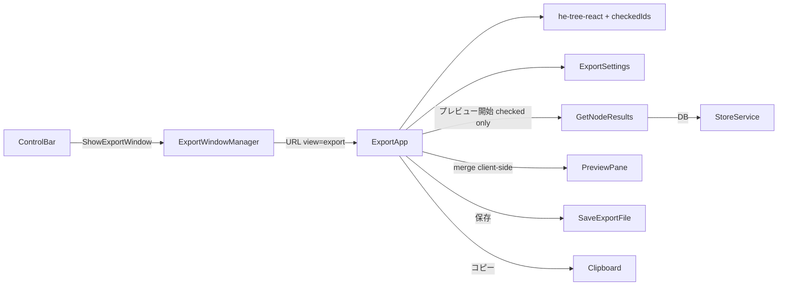

# エクスポートウィンドウ改修プラン

## 合意済み設計（grill-me 結果）

| 項目 | 決定 |
|------|------|
| 左サイドバー | [he-tree-react](https://he-tree-react.phphe.com/v1/guide#data-types) の **フラットデータ**（`id` + `parent_id`） |
| 階層の初期化 | シード URL ノードから BFS で最短パス親を決定（DAG 対応） |
| ドラッグ | 親子関係の変更も可（`onChange` で flat data 更新） |
| 選択エクスポート | 選択ノードのみ表示、親が未選択なら `parent_id = null` |
| 右サイドバー設定 | 出力形式（markdown/html）、区切り文字、見出し（URL/ラベル付与の ON/OFF） |
| 最終アクション | プレビュー + ファイル保存 + クリップボードコピー |
| ウィンドウ | 単一ウィンドウ再利用（[`node_result_window.go`](front/internal/usecase/wails_service/node_result_window.go) と同パターン） |
| チェックボックス | 各ノードにチェックボックス。チェック OFF はプレビュー・保存・コピー対象外 |
| 親子連動 | he-tree-react 標準のカスケード（`updateCheckedInFlatData`）。半チェック状態あり |
| 初期チェック | 表示されている全ノード ON |
| チェック OFF 表示 | ツリーに残す（グレーアウト）、ドラッグ・順序編集は可能 |
| 一括操作 | 左サイドバー上部に「全選択」「全解除」 |
| 結果なしノード | チェック ON でも DB 結果なしはスキップし、トーストで「N 件除外」と通知 |

## スキル適用（[`.cursor/skills/`](.cursor/skills/)）

実装時に該当スキルを読み、ルールに従う。各セクションにも「参考スキル」を明記する。

| スキル | 適用箇所 | 適用しない理由（該当時） |
|--------|----------|--------------------------|
| [`tsx-i18n-messages`](.cursor/skills/tsx-i18n-messages/SKILL.md) | すべての新規/改修 TSX（`ControlBar`, `ExportApp` 一式）、`messages.ts` | — |
| [`go-docstring-style`](.cursor/skills/go-docstring-style/SKILL.md) | Go 新規/改修: `export_window.go`, `api.go` の DTO, `store_service.go` の公開メソッド | — |
| [`test-overview-style`](.cursor/skills/test-overview-style/SKILL.md) | `exportTree.test.ts`（および Go テストを追加する場合） | — |
| [`go-wire`](.cursor/skills/go-wire/SKILL.md) | **原則不要** — `NodeResultWindowManager` と同様 `SetApp` で注入するため Wire グラフ変更なし。composition root に新 Provider を足す場合のみ参照 | 通常は `SetApp` パターンで足りる |
| [`design-to-shadcn-css`](.cursor/skills/design-to-shadcn-css/SKILL.md) | **不要** — 既存 `globals.css` トークンと shadcn コンポーネントをそのまま利用。DESIGN.md の色変数同期は行わない | テーマ変更がない |

## アーキテクチャ



## 1. バックエンド（Go）

> **参考スキル**: [`go-docstring-style`](.cursor/skills/go-docstring-style/SKILL.md) — 新規 struct・メソッド・DTO フィールドに docstring。`mode`（`all` \| `selected`）は値ごとの挙動を改行付きで記載。

### 新規: `ExportWindowManager`
[`node_result_window.go`](front/internal/usecase/wails_service/node_result_window.go) をテンプレートに、以下を追加:

- ウィンドウ名: `export-preview`、URL: `/?view=export`
- スナップショット DTO: `ExportSessionRequest`（[`api.go`](front/internal/model/api.go)）
  - `workspaceId`, `mode` (`all` | `selected`), `seedUrl`
  - `nodes[]`（`id`, `urlNormalized`, `label`, `status`）
  - `edges[]`（`source`, `target`）
  - `selectedNodeIds[]`（選択モード時）
- `ShowExportWindow(req)` / `GetExportSession()` + Wails イベント `export:open`

### 新規: `SaveExportFile`
[`project_service.go`](front/internal/usecase/wails_service/project_service.go) の `SaveScrb` と同様に `SaveFile` ダイアログ + ファイル書き込み:

```go
func (s *StoreService) SaveExportFile(content string, defaultExt string) error
```

- markdown → `*.md`、html → `*.html` フィルタ

### 配線
- [`store_service.go`](front/internal/usecase/wails_service/store_service.go): `SetApp` で `ExportWindowManager` 初期化、`WireMainWindow` でメイン終了時にエクスポートウィンドウも閉じる
- 実装後 `make -C front bindings` で TS バインディング再生成
- Wire グラフ自体は変更しない。`go-wire` スキルは composition root 変更が発生した場合のみ参照

## 2. フロントエンド

> **参考スキル**: [`tsx-i18n-messages`](.cursor/skills/tsx-i18n-messages/SKILL.md) — ボタン・ラベル・aria-label・トースト文言はすべて `messages.ts` 経由。TSX 直書き禁止。

### ControlBar 改修
[`ControlBar.tsx`](front/frontend/src/components/layout/ControlBar.tsx) 139–156 行:

- ラベル: `messages.menu.exportAll` / `messages.menu.exportSelected`（「全結果エクスポート」「選択エクスポート」）
- `onClick`: 即時マージではなく `openExportWindow('all' | 'selected')` を呼ぶ
- 既存 `mergeAllResults` / `mergeSelectedResults` の即時 Dialog 表示は廃止

### 新規エクスポート画面
[`App.tsx`](front/frontend/src/App.tsx) に `view=export` 分岐を追加（`MaximizedNodeResultApp` と同様）:

```
ExportApp/
  ExportOrderSidebar.tsx    # he-tree-react
  ExportPreviewPane.tsx     # ReactMarkdown or HTML preview
  ExportSettingsSidebar.tsx # 設定 + プレビュー開始 + 保存 + コピー
```

レイアウトは [`AppShell.tsx`](front/frontend/src/components/layout/AppShell.tsx) と同様に `react-resizable-panels` の 3 カラム。

### 左サイドバー: チェックボックス付きツリー（`ExportOrderSidebar.tsx`）
> **参考スキル**: `tsx-i18n-messages` — ノード表示は URL/ラベル（データ由来）、操作 UI 文言は messages 経由。既存 shadcn `Checkbox` / `Button` を流用（`design-to-shadcn-css` は不要）。

- he-tree-react の `updateCheckedInFlatData` で親子カスケードチェックを実装
- `checkedIds` / `semiCheckedIds` を state 管理。初期値は表示ノード全件 ON
- `renderNode` 内に shadcn `Checkbox`（または `<input type="checkbox">`）を配置
- チェック OFF ノードは `opacity-50 text-muted-foreground` でグレーアウト
- ツールバー: 「全選択」「全解除」ボタン（`checkedIds` を一括更新）
- チェック済み 0 件のとき「プレビュー開始」「保存」「コピー」を disabled

### コアロジック（新規 `lib/exportTree.ts`）
- `buildInitialFlatTree(nodes, edges, seedUrl, mode, selectedIds)` — BFS で `parent_id` 初期化、選択モードはサブセット再計算
- `initialCheckedIds(flatData)` — 表示ノード全 ID を返す（初期 ON 用）
- `preorderNodeIds(flatData, checkedIds)` — **チェック ON のノードのみ**深さ優先・前順でマージ順を導出
- `mergeExportContent(results, settings)` — 見出し・区切り・形式に応じてクライアント側マージ
  - 見出し ON: 現行と同様 `## {url|label}`（設定で切替）
  - 区切り: ユーザー指定（デフォルト `\n\n---\n\n`）
  - html: `CrawlResultPreview.html` を連結

### プレビューフロー
1. 右サイドバー「プレビュー開始」押下（`checkedIds.length > 0` 必須）
2. `preorderNodeIds(flatData, checkedIds)` で対象・順序確定
3. 既存 [`getNodeResults`](front/frontend/src/adapters/compositeScraperAdapter.ts) で DB から取得（ボタン押下時のみ）
4. 結果なしノードを除外し、除外件数 > 0 ならトースト通知（`messages.export.skippedNoResult(n)`）
5. `mergeExportContent` → 中央ペインに表示

### 保存 / コピー
- 対象はプレビューと同じ（チェック ON かつ DB 結果ありのノードのみ）
- コピー: [`NodeResultPanel.tsx`](front/frontend/src/components/layout/node-result/NodeResultPanel.tsx) と同様 `navigator.clipboard.writeText`
- 保存: `SaveExportFile` RPC（プレビュー未生成時、または checked 0 件時は disabled）

### appStore 整理
[`appStore.ts`](front/frontend/src/stores/appStore.ts):

- 削除: `mergeSheetOpen`, `mergeSheetContent`, `closeMergeSheet`, 旧 `mergeAllResults` / `mergeSelectedResults`
- 追加: `openExportWindow(mode)` — アクティブ WS の nodes/edges/seedUrl/selectedIds をスナップショット化して `ShowExportWindow` 呼び出し

### 廃止
- [`MergeSheet.tsx`](front/frontend/src/components/layout/MergeSheet.tsx) と [`AppShell.tsx`](front/frontend/src/components/layout/AppShell.tsx) からの参照を削除

### 依存追加
```bash
npm install he-tree-react --prefix front/frontend
```

`useHeTree` + `sortFlatData` でフラットデータ管理。`onChange` でドラッグ後の順序・親子を state 更新。`canDrop` はデフォルト（フル reparent 許可）。チェックは `checkedIds` オプション + `updateCheckedInFlatData` で連動。

### i18n
> **参考スキル**: [`tsx-i18n-messages`](.cursor/skills/tsx-i18n-messages/SKILL.md) を必ず読んでから実装。

[`messages.ts`](front/frontend/src/i18n/messages.ts) に `export` セクション追加:
- ボタンラベル、設定項目、プレビュー開始、保存、コピー、空状態メッセージ
- `selectAll` / `deselectAll` / `skippedNoResult(n)` / `noNodesChecked`

## 3. テスト

> **参考スキル**: [`test-overview-style`](.cursor/skills/test-overview-style/SKILL.md) — `describe`/`t.Run` に検証意図を1文で書く。非自明なセットアップは直前コメント。

- `exportTree.test.ts`: BFS 親決定、選択サブセット、`preorderNodeIds` の checked フィルタ、merge 出力（見出し ON/OFF、区切り、html）

## 変更ファイル一覧（主要）

| 層 | ファイル |
|----|----------|
| Go | `export_window.go`（新規）, `api.go`, `store_service.go` |
| FE 新規 | `ExportApp.tsx`, `ExportOrderSidebar.tsx`, `ExportSettingsSidebar.tsx`, `ExportPreviewPane.tsx`, `lib/exportTree.ts` |
| FE 改修 | `ControlBar.tsx`, `App.tsx`, `appStore.ts`, `messages.ts`, `adapter.ts` |
| FE 削除 | `MergeSheet.tsx` |
| 依存 | `front/frontend/package.json` |

## 実装順序

1. `lib/exportTree.ts` + テスト（`test-overview-style` スキルを参考に）
2. Go: DTO + ExportWindowManager + SaveExportFile + bindings（`go-docstring-style` スキルを参考に）
3. ExportApp 3 パネル UI + he-tree-react（`tsx-i18n-messages` スキルを参考に）
4. ControlBar / appStore 切替、MergeSheet 削除
5. `messages.ts` 仕上げ、手動動作確認

## 手動確認項目

- 「全結果エクスポート」→ 別ウィンドウ、success ノードがツリー表示
- 「選択エクスポート」→ 選択ノードのみ、親未選択はルート化
- ドラッグで順序・親子変更 → プレビュー反映
- チェック OFF ノードがプレビュー/保存/コピーに含まれないこと
- 親チェックで子が連動、半チェック表示が正しいこと
- 全選択/全解除が動作すること
- 結果なしノード除外時にトーストが出ること
- チェック 0 件でプレビュー/保存/コピーが disabled になること
- 設定変更（形式/区切り/見出し）→ プレビュー反映
- 保存ダイアログで .md/.html 出力、コピー成功トースト
- 再押下で同一ウィンドウが内容更新されること
