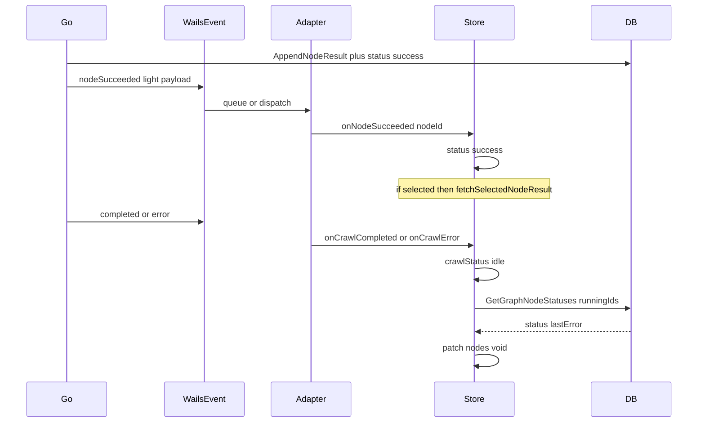

# クロール完了後 running 残留の根本修正

## 原因（固定）

- Go が DB に `success` を書いた後、大きい `result` 付き `scraper:crawl:nodeSucceeded` を Emit
- Wails v3 `Event.Emit` は順序保証なし／大 payload 不向き
- フロントは `completed`/`error` で購読解除するため、遅延・欠落した成功 Event があると UI だけ `running` のまま
- 再起動すると DB の `success` が読まれて直って見える

## 確定方針（grilling 済み）

1. **成功 Event 軽量化** — `CrawlEventPayload` から `Result` フィールド削除。Emit は `nodeId` / `url` / `runId` / `workspaceId` 等の status 通知のみ。DB の `AppendNodeResult` + `PatchGraphNodeStatus("success")` は維持
2. **本文は選択時取得** — `GetNodeResult` / `fetchSelectedNodeResult`。`nodeResultLoadingNodeId: string | null`。`NodeResultPanel` に `loading` prop でスケルトン。選択中が success になったら Event 経路・reconcile 経路の両方で自動 fetch
3. **完了時 v** — UI 上 `running` の nodeId だけ集め、新規 `GetGraphNodeStatuses` で DB の `status` + `lastError` をパッチ。WS 丸ごと `loadWorkspace` はしない。`completed` と `error` 両方。idle は即セット、reconcile は `void` 裏実行。DB が `running` なら UI もそのまま
4. **runId レース** — `StartCrawl` の `runId` 確定まで購読全トピックをキュー。確定後に `payload.runId === runId` だけ FIFO 再生。`runId === ''` で捨てる現状を廃止
5. **型** — `onNodeSucceeded(nodeId: string)` のみ（`result` 削除）
6. **テスト** — キュー／reconcile パッチは純ヘルパに切り出して単体テスト。Go は payload に本文なしを固定（実装時は `test-overview-style` / Go 側は `go-docstring-style`）
7. **CHANGELOG** — `[Unreleased]` に `### 修正` / 必要なら `### 追加`（`update-changelog`）

## 実装ステップ

### 1. Go: Event payload と Emit

- **スキル:** `go-docstring-style` を適用する（関数・メソッド・struct フィールドの docstring）
- `[front/internal/model/api.go](front/internal/model/api.go)` — `CrawlEventPayload` から `Result` 削除
- `[front/internal/usecase/wails_service/scraper_service.go](front/internal/usecase/wails_service/scraper_service.go)` — `topicNodeSucceeded` Emit から `Result: dto` を外す（persist は現状どおり）。`resultToDTO` 呼び出しは persist 用に残す
- Wails 生成 bindings（`front/frontend/bindings/...`）を再生成／追従

### 2. Go: `GetGraphNodeStatuses` API

- **スキル:** `go-docstring-style` を適用する。新規依存を composition root に足す場合は `go-wire` を適用する（既存 `StoreService` へのメソッド追加のみなら Wire 変更不要）

層を既存の `GetNodeResult` と同様に通す:

- model: `GraphNodeStatusDTO { NodeID, Status, LastError }`
- persistence: `workspaceID` + `nodeIDs[]` で `graph_nodes` から status / last_error を取得（空 `nodeIDs` は空スライス即 return）
- domain（`CrawlPersistService` または既存 graph 系）
- `[StoreService](front/internal/usecase/wails_service/store_service.go)` に Wails 公開メソッド
- Go 単体テスト: 指定 ID の status/lastError が返ること

### 3. フロント: adapter キュー

- `[compositeScraperAdapter.ts](front/frontend/src/adapters/compositeScraperAdapter.ts)`
  - `runId` 未確定中は全購読トピックの payload をキュー
  - `StartCrawl` の `runId` 確定後、FIFO で `runId` 一致のみ handler 実行
  - `nodeSucceeded`: `!p.result` ガード削除。`onNodeSucceeded(p.nodeId)` のみ（`p.nodeId` 必須）
- 純ヘルパ例: `front/frontend/src/lib/crawlEventQueue.ts`（enqueue / flushMatching）を切り出しテスト

### 4. フロント: 型・store・UX

- **スキル:** TSX 表示文言は `tsx-i18n-messages` を適用する（`messages.ts` 集約。コンポーネント内ハードコード禁止）
- `[types/adapter.ts](front/frontend/src/types/adapter.ts)` / `[types/crawl.ts](front/frontend/src/types/crawl.ts)` — `onNodeSucceeded: (nodeId: string) => void`
- `[appStore.ts](front/frontend/src/stores/appStore.ts)`
  - `nodeResultLoadingNodeId`
  - `onNodeSucceeded`: `status: 'success'`, `lastError` クリア。`lastResult` は Event で埋めない。選択中なら `fetchSelectedNodeResult`
  - `fetchSelectedNodeResult`: 開始時に `nodeResultLoadingNodeId = nodeId`、完了時に選択／ID 一致なら `loadedNodeResult` 更新し loading クリア（不一致は破棄）
  - `onCrawlCompleted` / `onCrawlError`: idle 等セット後、`void reconcileRunningNodeStatuses(wsId)`
  - reconcile: UI `running` IDs → `getGraphNodeStatuses` → status/lastError パッチ。選択中が `success` になったら fetch
- Port / adapter に `getGraphNodeStatuses` 追加
- `[NodeResultPanel.tsx](front/frontend/src/components/layout/node-result/NodeResultPanel.tsx)` — `loading` 時は既存 `Skeleton` 表示
- `[RightSidebar.tsx](front/frontend/src/components/layout/RightSidebar.tsx)` — `nodeResultLoadingNodeId === node.id` を `loading` に渡す
- `[messages.ts](front/frontend/src/i18n/messages.ts)` — `messages.right` に読み込み文言／aria

### 5. テスト（必須）

- **スキル:** テスト追加・編集時は `test-overview-style` を適用する。Go テスト側の公開 API／ヘルパには `go-docstring-style` も適用する

| ケース                                                 | 置き場所                                     |
| --------------------------------------------------- | ---------------------------------------- |
| runId 確定前イベントが確定後に処理                                | `crawlEventQueue` 系 TS テスト               |
| result なし nodeSucceeded → success                   | store パッチ or adapter ハンドラ相当の純ロジック TS テスト |
| 完了後 running が API 結果で reconcile                     | reconcile 純ヘルパ TS テスト                    |
| Go nodeSucceeded payload に html/markdown/rawHtml なし | Go テスト（Emit 内容または payload 組み立てを検証）       |
| GetGraphNodeStatuses                                | Go persistence/domain テスト                |

### 6. CHANGELOG

- **スキル:** `update-changelog` を適用する

ルート `[CHANGELOG.md](CHANGELOG.md)` の `## [Unreleased]`:

- `### 修正` — クロール完了後にノードが running のまま残る問題を修正（Event 軽量化・完了時 reconcile・runId キュー）
- `### 追加` — `GetGraphNodeStatuses`、ノード結果取得中のスケルトン表示

## 受け入れ条件（実装後確認）

- 完了後に running スピナーが残らない（Event 欠落時も reconcile で回復）
- 再起動なしで DB 成功ノードが UI でも success
- 成功 Event に大きい本文が乗らない
- 選択時／選択中 success 時はスケルトン → 本文
- crawl モード 1–4・pause/resume/stop を壊さない
- コミットは依頼されるまで作らない

## 触らないもの

- WS 丸ごと `loadWorkspace` での上書き
- crawl モードロジック・pause/resume/stop の仕様変更
- 不要なリファクタや無関係ファイルの整理

