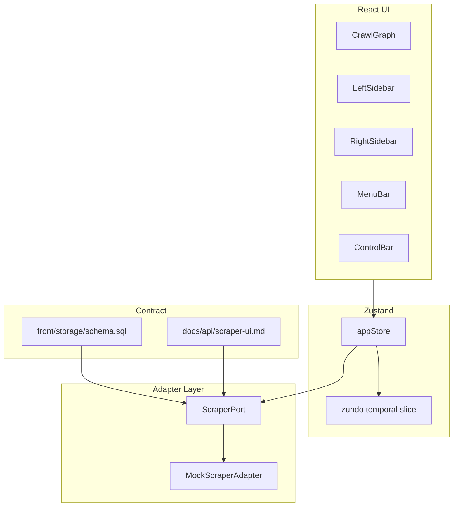

# フロントエンド改善実装計画（レビュー修正版）

## レビュー結果サマリ

[`tmp_frontend_improvement_plan.md`](tmp_frontend_improvement_plan.md) と旧版プランを突合。**以前の不足・齟齬**を下表のとおり修正した。

| 問題 | 対応 |
|------|------|
| Phase4 を「計画更新のみ」に縮小していた | **tmp 要件どおり UI 実装を Stage 5 に復帰**（Grill 時の一時判断を上書き） |
| 設定「適切に決める」+「フォーム」が曖昧 | **設定フィールド定義表**（§2）と Stage 3 で4層フォームを明示 |
| 右サイドバーの折りたたみ・リサイズ未記載 | Stage 2 に **左右 SB** を明記 |
| ControlBar に「すべて折りたたむ」未記載 | Stage 2 に **全展開 / 全折りたたみ** の両ボタン |
| 一括スクレイプの実行仕様なし | Stage 4 に **RunMode 4・nodeIds 必須** を明記 |
| redo・Shift 連続選択の記載薄い | Stage 2/3 にショートカット・選択順序を追記 |
| 要件トレーサビリティなし | **§1 要件一覧表**を追加 |

---

## 1. 要件トレーサビリティ（tmp_frontend_improvement_plan.md）

| # | 要件 | ステージ | 実装方針 |
|---|------|----------|----------|
| R01 | サーバー通信を adapter に切り出し（モック） | 1 | `ScraperPort` + `MockScraperAdapter` |
| R02 | 成功ノードクリック → サーバーから結果取得（モック） | 4 | `status === 'success'` のときのみ `getNodeResult`；それ以外は展開のみ |
| R03 | ノードクリック → 展開して詳細表示 | 2 | グラフ上インライン展開（URL・status・設定サマリ） |
| R04 | データ構造厳密化 + SQLite DDL | 1 | [`front/storage/schema.sql`](front/storage/schema.sql) + [`types/db.ts`](front/frontend/src/types/db.ts) |
| R05 | フロントは DDL 前提でサーバーとやり取り | 1 | `dbMappers` + Port DTO |
| R06 | アプリ/WS/ノードの適切な設定 | 1,3 | §2 フィールド定義表 + Zod |
| R07 | アプリ/WS/ノードをフォームで設定 | 3 | §2 のフォームのみ（**JSON エディタ・詳細 JSON タブは廃止**） |
| R08 | ドメイン設定の適切な定義 | 1,3 | §2 ドメイン列 + `domain_settings` テーブル |
| R09 | ドメインをフォームで設定 | 3 | 左 SB 選択 + 右 SB `DomainSettingsForm` |
| R10 | 親子関係の折りたたみ | 2 | `collapsedNodeIds` + 子孫非表示 |
| R11 | ControlBar にすべて展開 | 2 | `expandAllInWorkspace()` |
| R12 | サイドメニュー折りたたみ + エッジドラッグでリサイズ | 2 | **左 SB・右 SB 両方**（`PanelGroup` + collapse toggle） |
| R13 | トップバー右：全結果マージ表示 | 4 | `MenuBar` 右側ボタン → `mergeResults(wsId, null)` → Sheet |
| R14 | トップバー右：選択ノード結果マージ | 4 | 選択あり時のみ有効 → `mergeResults(wsId, selectedIds)` |
| R15 | 結果はすべて API（adapter）から取得 | 1–4 | `lastResult` の直接参照を廃止し Port 経由に統一 |
| R16 | 複数選択ノード：右 SB にプレビュー → adapter で表示 | 4 | `getNodeResults` + プレビューボタン |
| R17 | API 設計仕様 | 1 | [`docs/api/scraper-ui.md`](docs/api/scraper-ui.md) |
| R18 | 仕様に基づく adapter | 1 | Port インターフェース = 仕様の TypeScript 表現 |
| R19 | 複数選択（Ctrl/Shift/矩形/Ctrl+A） | 2 | React Flow 設定 + Shift 連続選択は **グラフ BFS 順**で ID 範囲 |
| R20 | Ctrl+C / Ctrl+V | 3 | 選択 subgraph コピー（エッジは両端が選択内のみ） |
| R21 | undo/redo（zundo） | 3 | `zundo` temporal；**Ctrl+Z / Ctrl+Shift+Y** |
| R22 | ノード・エッジ右クリックメニュー | 3 | shadcn `ContextMenu` |
| R23 | エッジ手動追加・削除 | 3 | `onConnect` 追加 + 既存 `onEdgesDelete` 維持 |
| R24 | エッジ接続制約（片側最大1つ） | 3 | Grill 確定：**同一 source→target 1 本**、複数 outgoing 可 |
| R25 | exclude 配下をグレーアウト | 2 | `crawlExclude` 子孫に visual スタイル |
| R26 | 複数選択の一括削除 | 3 | コンテキストメニュー + Delete キー |
| R27 | 複数選択の一括展開 | 3 | 選択ルートごとに子孫を表示 |
| R28 | 複数選択の一括折りたたみ | 3 | 選択ルートごとに子孫を非表示 |
| R29 | 複数選択の一括スクレイピング | 4 | **RunMode 4**、選択ノードを入力順に scrape（リンク探索なし） |
| R30 | 複数選択の結果表示・保存・削除 | 4 | 右 SB / コンテキスト：`getNodeResults` / `saveResults` / `deleteResults` |
| R31 | 左メニューに WS コピーアイコン | 3 | `duplicateWorkspace(id)` |
| R32 | front_ui_mock_plan と矛盾なし | 1,5 | 旧計画に上書き決定 + Phase4 節追記 |
| R33 | Phase4：WS 単位の既存 vs 現在の差分表示 | 5 | §5 参照（3 種差分 + アイコン） |
| R34 | Phase4：左メニュー WS に差分確認ボタン | 5 | `getWorkspaceDiff` → バッジ / ダイアログ |

**カバー率**: 上表 34 項目中 34 件をステージに割当済み（R24 の「片側最大1つ」は Grill #4 の解釈を脚注で tmp に明記推奨）。

---

## 2. 設定フィールド定義（R06–R09）

[`backend/configs/config.example.yaml`](backend/configs/config.example.yaml) に準拠。優先順位は **ノード > ドメイン > WS > アプリ**（[`mergeConfig`](front/frontend/src/lib/mergeConfig.ts)）。

**共通方針**

- すべて **フォーム UI のみ**（現行 MenuBar の JSON テキストエリアは **廃止**。「詳細 JSON」タブは **作らない**）。
- Stage 1 で [`schemas/config.ts`](front/frontend/src/schemas/config.ts) を `config.example.yaml` 相当まで拡張（下記フィールドを Zod で検証）。
- DDL 上は `settings_json` / `defaults_json` / `node_settings_json` に **部分型 JSON** を格納（[`types/config.ts`](front/frontend/src/types/config.ts) の `PartialConfig` と一致）。

### 2.1 ワークスペース（`workspaces.settings`）

WS フォームは **request / content / pdf / crawl のほぼ全フィールド**をタブ分割で編集する。加えて WS メタデータ（`name`, `seed_url`）は別タブまたは General セクション。

#### request（[`config.example.yaml` L22–41](backend/configs/config.example.yaml)）

| フィールド | 型 | UI コントロール |
|------------|-----|-----------------|
| `request.headers` | `Record<string, string>` | キー・値の追加/削除行（User-Agent 含む） |
| `request.timeout` | duration 文字列 | 入力（例: `60s`） |
| `request.retry_count` | `0..10` | 数値 |
| `request.retry_interval` | duration 文字列 | 入力（例: `1s`） |

#### content（L46–79）

| フィールド | 型 | UI コントロール |
|------------|-----|-----------------|
| `content.formats` | `markdown` \| `html` \| `raw_html` \| `json` \| `links` \| `metadata` の配列 | 複数選択（重複不可） |
| `content.only_main_content` | boolean | スイッチ |
| `content.include_tags` | string[] | タグリスト入力 |
| `content.exclude_tags` | string[] | タグリスト入力 |
| `content.selector` | string | テキスト（CSS セレクタ） |
| `content.extract_links` | boolean | スイッチ |
| `content.extract_metadata` | boolean | スイッチ |

#### pdf（L84–105）

| フィールド | 型 | UI コントロール |
|------------|-----|-----------------|
| `pdf.enabled` | boolean | スイッチ |
| `pdf.mode` | `fast` \| `auto` \| `ocr` | セレクト |
| `pdf.max_pages` | `0..10000` | 数値（0 = 無制限） |
| `pdf.output` | `text` \| `markdown` \| `raw` | セレクト |

#### crawl（L110–147）

| フィールド | 型 | UI コントロール |
|------------|-----|-----------------|
| `crawl.enabled` | boolean | スイッチ |
| `crawl.max_depth` | `0..10` | 数値 |
| `crawl.max_pages` | `1..100000` | 数値 |
| `crawl.include_paths` | string[]（Go 正規表現） | 行追加リスト |
| `crawl.exclude_paths` | string[]（Go 正規表現） | 行追加リスト |
| `crawl.allow_external_links` | boolean | スイッチ |
| `crawl.allow_subdomains` | boolean | スイッチ |
| `crawl.request_delay` | duration 文字列 | 入力 |
| `crawl.max_concurrency` | `1..64` | 数値 |
| `crawl.respect_robots_txt` | boolean | スイッチ |

#### WS メタデータ（YAML 外・グラフ UI 用）

| フィールド | 保存先 | UI |
|------------|--------|-----|
| `name` | `workspaces.name` | テキスト |
| `seed_url` | `workspaces.seed_url` | URL 入力 |
| `exclude_urls` | `workspaces.exclude_urls_json` | 既存ロジック（ノード exclude と連動） |
| `graph_layout_direction` | `workspaces.graph_layout_direction` | ControlBar / 設定 |

**WS に含めないもの（アプリ既定のみ）**: `plugins`, `output`, `targets`（targets は `seed_url` + グラフノードで表現）。

### 2.2 アプリ（`app_config.defaults_json`）

WS の request/content/pdf/crawl **に加え**、アプリ全体の既定として以下もフォーム編集:

#### plugins（L154–197）

| フィールド | UI |
|------------|-----|
| `plugins.fetcher` | セレクト（`http` / `chromium`） |
| `plugins.fetcher_config.browser_path` | テキスト |
| `plugins.fetcher_config.user_agent` | テキスト |
| `plugins.fetcher_config.headless` | スイッチ |
| `plugins.fetcher_config.wait_visible_selector` | テキスト |
| `plugins.fetcher_config.wait_timeout` | duration |
| `plugins.preprocessors` | 複数選択（`header` 等） |
| `plugins.parsers` | 複数選択（`html`, `pdf`） |
| `plugins.transformer` | セレクト |
| `plugins.filters` | 複数選択 |
| `plugins.link_extractor` | セレクト |

#### output（L202–213）

| フィールド | UI |
|------------|-----|
| `output.dir` | テキスト |
| `output.file_pattern` | テキスト |

アプリフォームにも **request / content / pdf / crawl** の全フィールド（§2.1 同型）を載せ、WS 未指定時のフォールバック元とする。

### 2.3 ドメイン（`domain_settings.settings_json`）

ホスト単位の **PartialConfig**。WS で足りない上書き用。フォームは §2.1 と同型コンポーネントを再利用し、**ドメインで上書きするフィールドだけ**表示（未設定 = WS 継承）。推奨デフォルト表示: `crawl.*`, `request.headers`, `content.formats`, `content.selector`, `pdf.enabled`。

### 2.4 ノード（`graph_nodes.node_settings_json` + `crawl_exclude`）

| フィールド | UI |
|------------|-----|
| `crawlExclude` | チェック（列 `crawl_exclude`） |
| §2.1 の request/content/pdf/crawl | 右 SB・インライン展開で **ノード上書き分のみ**（フィールド単位マージ） |

**Stage 3 完了条件**: 4層すべてフォームのみで編集可能。MenuBar JSON ダイアログは削除。

---

## Grill で確定した決定（維持）

| 論点 | 決定 |
|------|------|
| 永続化境界 | DDL + API 契約 → モック adapter；SQLite ランタイムは次フェーズ |
| アダプター形 | TS Port + Mock / 将来 Wails；[`docs/api/scraper-ui.md`](docs/api/scraper-ui.md) |
| undo/redo | zundo — 意図的編集のみ；**redo 含む** |
| エッジ制約 | 同一 source→target 1 本（tmp の「片側」との対応は §6 脚注） |
| ノードクリック UX | 単選：インライン展開 + 右 SB 結果；複選：プレビューボタン |
| 実装順 | 5 段階（Stage 5 = Phase4 **UI 実装**） |

旧計画 [`front_ui_mock_plan_5d310e0a.plan.md`](.cursor/plans/front_ui_mock_plan_5d310e0a.plan.md) 上書き: ショートカット・undo・手動エッジ追加・DDL 先行。

---

## 目標アーキテクチャ



---

## 3. DDL（契約・全文）

実装ファイル: [`front/storage/schema.sql`](front/storage/schema.sql)（以下をそのまま配置する）。

```sql
-- scraper-bot UI 永続層スキーマ（SQLite）
-- フロント DTO・ScraperPort・将来 Wails SQLite 実装の単一の正。
-- JSON 列は types/config.ts の AppConfig / PartialConfig 形状に一致させる。

PRAGMA foreign_keys = ON;

-- ---------------------------------------------------------------------------
-- アプリ全体のデフォルト設定（singleton）
-- defaults_json: AppConfig（request, content, pdf, crawl, plugins, output）
-- ---------------------------------------------------------------------------
CREATE TABLE app_config (
    id              INTEGER PRIMARY KEY CHECK (id = 1),
    defaults_json   TEXT NOT NULL,
    updated_at      TEXT NOT NULL DEFAULT (datetime('now'))
);

-- ---------------------------------------------------------------------------
-- ワークスペース
-- settings_json: PartialConfig のうち request, content, pdf, crawl（§2.1 全フィールド）
-- exclude_urls_json: string[]（正規化 URL。ノード「クロールしない」と同期）
-- baseline_run_id: Phase4 差分の「既存」スナップショット（crawl_runs.id）
-- ---------------------------------------------------------------------------
CREATE TABLE workspaces (
    id                      TEXT PRIMARY KEY,
    name                    TEXT NOT NULL,
    seed_url                TEXT NOT NULL,
    settings_json           TEXT NOT NULL DEFAULT '{}',
    exclude_urls_json       TEXT NOT NULL DEFAULT '[]',
    graph_layout_direction  TEXT NOT NULL DEFAULT 'LR'
                            CHECK (graph_layout_direction IN ('LR', 'TB')),
    baseline_run_id         TEXT,
    created_at              TEXT NOT NULL DEFAULT (datetime('now')),
    updated_at              TEXT NOT NULL DEFAULT (datetime('now'))
    -- baseline_run_id は crawl_runs.id を参照（循環 FK を避けるため DB 制約は張らない）
);

CREATE INDEX idx_workspaces_updated_at ON workspaces(updated_at);

-- ---------------------------------------------------------------------------
-- グラフノード（ワークスペース内）
-- node_settings_json: PartialConfig（ノード上書き。§2.4）
-- crawl_exclude: 1 = このノードを「クロールしない」
-- status: idle | running | success | error | skipped
-- ---------------------------------------------------------------------------
CREATE TABLE graph_nodes (
    workspace_id        TEXT NOT NULL,
    id                  TEXT NOT NULL,
    url_normalized      TEXT NOT NULL,
    label               TEXT NOT NULL,
    position_x          REAL NOT NULL,
    position_y          REAL NOT NULL,
    user_positioned     INTEGER NOT NULL DEFAULT 0 CHECK (user_positioned IN (0, 1)),
    node_settings_json  TEXT NOT NULL DEFAULT '{}',
    crawl_exclude       INTEGER NOT NULL DEFAULT 0 CHECK (crawl_exclude IN (0, 1)),
    status              TEXT NOT NULL DEFAULT 'idle'
                        CHECK (status IN ('idle', 'running', 'success', 'error', 'skipped')),
    last_error          TEXT,
    PRIMARY KEY (workspace_id, id),
    FOREIGN KEY (workspace_id) REFERENCES workspaces(id) ON DELETE CASCADE,
    UNIQUE (workspace_id, url_normalized)
);

CREATE INDEX idx_graph_nodes_workspace_status ON graph_nodes(workspace_id, status);

-- ---------------------------------------------------------------------------
-- グラフエッジ（有向）
-- 制約: 同一 (workspace_id, source_node_id, target_node_id) は1本（Grill #4）
-- ---------------------------------------------------------------------------
CREATE TABLE graph_edges (
    workspace_id    TEXT NOT NULL,
    id              TEXT NOT NULL,
    source_node_id  TEXT NOT NULL,
    target_node_id  TEXT NOT NULL,
    PRIMARY KEY (workspace_id, id),
    FOREIGN KEY (workspace_id) REFERENCES workspaces(id) ON DELETE CASCADE,
    FOREIGN KEY (workspace_id, source_node_id)
        REFERENCES graph_nodes(workspace_id, id) ON DELETE CASCADE,
    FOREIGN KEY (workspace_id, target_node_id)
        REFERENCES graph_nodes(workspace_id, id) ON DELETE CASCADE,
    UNIQUE (workspace_id, source_node_id, target_node_id)
);

-- ---------------------------------------------------------------------------
-- ドメイン別設定（host 単位）
-- settings_json: PartialConfig（§2.3）
-- ---------------------------------------------------------------------------
CREATE TABLE domain_settings (
    workspace_id    TEXT NOT NULL,
    host            TEXT NOT NULL,
    settings_json   TEXT NOT NULL DEFAULT '{}',
    PRIMARY KEY (workspace_id, host),
    FOREIGN KEY (workspace_id) REFERENCES workspaces(id) ON DELETE CASCADE
);

-- ---------------------------------------------------------------------------
-- クロール実行履歴
-- mode: 1 | 2 | 3（RunMode）
-- status: running | paused | completed | stopped | error
-- summary_json: CrawlRunSummary 相当
-- ---------------------------------------------------------------------------
CREATE TABLE crawl_runs (
    id              TEXT PRIMARY KEY,
    workspace_id    TEXT NOT NULL,
    mode            INTEGER NOT NULL CHECK (mode IN (1, 2, 3)),
    status          TEXT NOT NULL
                    CHECK (status IN ('running', 'paused', 'completed', 'stopped', 'error')),
    started_at      TEXT NOT NULL,
    finished_at     TEXT,
    summary_json    TEXT,
    error_message   TEXT,
    FOREIGN KEY (workspace_id) REFERENCES workspaces(id) ON DELETE CASCADE
);

CREATE INDEX idx_crawl_runs_workspace_started ON crawl_runs(workspace_id, started_at DESC);

-- ---------------------------------------------------------------------------
-- ノード単位のスクレイピング結果（永続層）
-- 本文・リンク・メタは backend model.Result に合わせる
-- content_hash: Phase4 本文差分用（markdown 等のハッシュ）
-- ---------------------------------------------------------------------------
CREATE TABLE node_results (
    id              TEXT PRIMARY KEY,
    run_id          TEXT NOT NULL,
    workspace_id    TEXT NOT NULL,
    node_id         TEXT NOT NULL,
    url             TEXT NOT NULL,
    markdown        TEXT,
    html            TEXT,
    raw_html        TEXT,
    json_body       TEXT,
    links_json      TEXT,
    metadata_json   TEXT,
    error           TEXT,
    fetched_at      TEXT NOT NULL,
    content_hash    TEXT,
    FOREIGN KEY (run_id) REFERENCES crawl_runs(id) ON DELETE CASCADE,
    FOREIGN KEY (workspace_id, node_id)
        REFERENCES graph_nodes(workspace_id, id) ON DELETE CASCADE
);

CREATE INDEX idx_node_results_run ON node_results(run_id);
CREATE INDEX idx_node_results_ws_node_fetched
    ON node_results(workspace_id, node_id, fetched_at DESC);

-- ---------------------------------------------------------------------------
-- UI 補助: 折りたたみ状態（ワークスペースごと・任意永続）
-- ---------------------------------------------------------------------------
CREATE TABLE graph_ui_state (
    workspace_id            TEXT PRIMARY KEY,
    collapsed_node_ids_json TEXT NOT NULL DEFAULT '[]',
    FOREIGN KEY (workspace_id) REFERENCES workspaces(id) ON DELETE CASCADE
);
```

**DTO マッピング（要約ではない実装契約）**

- `loadWorkspace` は上記テーブルを JOIN し、UI の `Workspace` + `GraphNode[]` + `GraphEdge[]` + `domainSettings` に組み立てる。
- ノードの `lastResult` は **DB に持たない**。表示時は `node_results` の `(workspace_id, node_id)` 最新行を adapter が hydrate。
- `saveWorkspace` は graph_nodes / graph_edges / domain_settings / workspaces をトランザクションで upsert。

---

## 4. API 仕様 + Port

[`docs/api/scraper-ui.md`](docs/api/scraper-ui.md): HTTP + Wails メソッド名。

`ScraperPort`（抜粋）:

- ワークスペース: `loadWorkspace`, `saveWorkspace`, `duplicateWorkspace`
- 結果: `getNodeResult`, `getNodeResults`, `mergeResults`, `saveResults`, `deleteResults`, `saveResultsSnapshot`
- 差分: `getWorkspaceDiff`（Stage 5）
- クロール: `startCrawl`, `pauseCrawl`, `stopCrawl`（選択ノード一括は `startCrawl({ mode: 2, nodeIds })`）

[`mockScraperAdapter.ts`](front/frontend/src/adapters/mockScraperAdapter.ts): fake repository（永続層のモック）+ 既存 [`crawlStub`](front/frontend/src/services/crawlStub.ts) BFS。

---

## 5. 五段階実装

### Stage 1 — 基盤（R01, R04–R06, R08, R15–R18, R32）

- §3 DDL 全文を `schema.sql` に配置、`db.ts`, `dbMappers`, API 仕様, Port/Mock
- `schemas/config.ts` を §2.1–2.2 の全フィールドに拡張（pdf / include_tags / plugins 等）
- `appStore`: crawl / 結果読み込みを Port 経由に
- `front_ui_mock_plan` に上書き決定を追記

### Stage 2 — グラフ・サイドバー UX（R03, R10–R12, R19, R25）

- 複数選択: Ctrl+click, Shift+click（**BFS 順でアンカー〜ターゲット間**）, 矩形, Ctrl+A
- 折りたたみ + ControlBar **「すべて展開」「すべて折りたたむ」**
- インライン展開（UrlNode 拡張）
- **左・右 SB**: 折りたたみトグル + ドラッグリサイズ（`react-resizable-panels` 推奨）
- exclude 配下グレーアウト

### Stage 3 — 編集・フォーム（R07, R09, R20–R24, R26–R28, R31）

- zundo + **Ctrl+Z / Ctrl+Shift+Y**
- 右クリック（ノード / エッジ / パネル）
- 手動エッジ `onConnect` + 削除維持
- コピペ、一括削除/展開/折りたたみ
- WS 複製アイコン（左 SB）
- **§2 の4層フォーム**（`WorkspaceSettingsForm` は request/content/pdf/crawl 全タブ。MenuBar JSON 削除）

### Stage 4 — 結果・マージ・一括クロール（R02, R13–R16, R29–R30）

- 成功ノード単選 → `getNodeResult` → 右 SB
- 複選（結果あり）→ プレビュー → `getNodeResults`
- MenuBar 右: 全マージ / 選択マージ（**API のみ**、ローカル lastResult 連結禁止）
- 一括スクレイプ: RunMode 4 + 選択 `nodeIds`
- 一括: 結果表示 / `saveResults` / `deleteResults`（コンテキスト + 右 SB）

### Stage 5 — Phase4 差分 UI（R33–R34）

tmp の「phase3 以降」= 旧計画 Phase3 相当の上に載せる **Phase4 機能**（実装する）。

- **baseline**: `workspaces.baseline_run_id`（`saveResultsSnapshot` で更新）
- **3 種差分**（`getWorkspaceDiff` 戻り値）:
  1. **content** — baseline run vs 最新成功行の `content_hash`（canonical markdown の SHA-256）
  2. **links** — 同上の **`links_json` のみ**（`graph_edges` は比較に使わない）
  3. **fetch** — baseline 行の成否と現在の取得状態（skipped 含む）
- **baseline モデル**: `baselineResults` の別 Map は使わない。`workspaces.baseline_run_id` → 当該 `crawl_runs` の `node_results` が正
- **履歴**: ノードごと `node_results` 最大 20 行。`DeleteResults` は最新 1 行のみ削除
- **Mock**: `crawl_runs` を INSERT/更新し `startCrawl` / `saveResultsSnapshot` と整合
- **ノード上**: 種別ごとアイコン（Badge）でハイライト
- **左 SB**: 各 WS 行に差分確認アイコン → クリックでサマリ（件数・種別内訳）
- Mock: 意図的に baseline と current をずらしたシードデータで手動確認可能に

---

## 6. テスト・リスク

- **単体**: dbMappers, エッジ UNIQUE, BFS 連続選択, zundo が crawl を巻き戻さない, diff 3 分類
- **手動**: 34 要件のチェックリスト（§1 表をそのまま使用）
- **脚注（R24）**: tmp の「片側で最大1つ」は **ノード間の有向エッジ重複禁止**として実装。1 ノードから複数 outgoing はクロール仕様上必須のため、tmp 原文との差は [`tmp_frontend_improvement_plan.md`](tmp_frontend_improvement_plan.md) に注釈1行追記を推奨。

---

## 7. 旧版プランからの主な変更点（今回レビュー）

1. **Phase4 を Stage 5 の実装タスクに復帰**（計画のみ → UI + Mock diff）
2. **WS 設定を request/content/pdf/crawl ほぼ全フィールド化**（§2.1）。JSON エディタ・詳細 JSON タブなし
3. **DDL を §3 に全文記載**（要約テーブルのみは廃止）
4. **右 SB** の折りたたみ・リサイズを追加
5. **ControlBar「すべて折りたたむ」**を追加
6. **要件トレーサビリティ表（§1）**で 34 項目を明示
7. **一括スクレイプ = RunMode 4**、結果保存 = `saveResults` を明記
