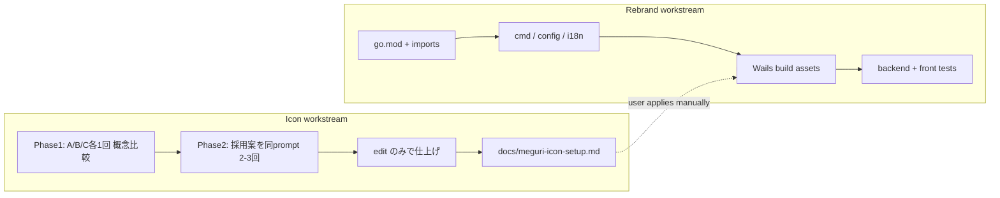

# Meguri リブランド + アイコン生成計画

## 確定済み前提

| 項目 | 値 |
|------|-----|
| 表示名 | **Meguri**（UI・タイトルバー） |
| 識別子 / バイナリ | `meguri`（デスクトップ）、`meguri-cli`（CLI） |
| Go module | `meguri`（backend / front とも） |
| 拡張子 | **`.crawlproj`**（`.scrb` 読み込み互換は維持） |
| manifest `app` | `meguri` |
| 既存データ | **移行なし** — 新パス `meguri.db` / `~/.local/share/meguri` のみ。旧データは手動コピー |
| アイコン成果物 | コードへの差し替えは行わず、**セット手順 MD** を成果物とする（ユーザーが候補を選定） |
| Bundle ID | **`com.example.meguri`**（プレースホルダ。リリース前に正式ドメインへ差し替え可） |

---

## ワークフロー全体



アイコン適用とコードリネームは**並行可能**。アイコン MD はリネーム後のパス名（`meguri`）で記述する。

---

## Part A: アイコン生成（GPT Image 2）

**必須参照**: 画像生成・edit の手順・プロンプト作法・制約は [`.agents/skills/gpt-image-2/SKILL.md`](.agents/skills/gpt-image-2/SKILL.md) に従う。実施時は SKILL を読んでから RunComfy を叩く。Windows では SKILL の Docker 手順（[`tools/runcomfy/README.md`](tools/runcomfy/README.md)）を使う。

### 統一性戦略（2 段階ワークフロー — 確定）

text-to-image を何度も別プロンプトで回すと、パレット・線幅・奥行きが毎回ブレる。**最終アセットは 1 枚にロックし、以降 edit のみ**。

| 段階 | 目的 | 手段 | 回数 |
|------|------|------|------|
| **Phase 1: 概念比較** | モチーフ選定（環 / グラフ / 道筋） | text-to-image | A/B/C **各 1 回のみ** |
| **Phase 2: マスター確定** | 採用モチーフのベスト 1 枚を選ぶ | 採用プロンプトで text-to-image | **同プロンプト 2〜3 回** |
| **Phase 3: 仕上げ** | 32px 可読性・コントラスト調整 | **edit のみ** | 1 回 1 変更（SKILL 推奨） |

**ルール**

- Phase 3 以降は **text-to-image を再実行しない**（別モチーフ・別スタイルに戻るため）
- edit では `Keep composition and palette unchanged` を毎回先頭に置く（SKILL の preservation 言語）
- `size=auto` on edit（SKILL 推奨）
- 共有スタイルブロックをプロンプト先頭に固定し、モチーフ部分だけ差し替え:

```
SHARED_STYLE = "Desktop app icon, centered, rounded-square canvas, dark blue-gray background #1b2636, minimal flat vector, subtle soft shadow, generous padding, high contrast silhouette readable at 32px, no text, no letters, no emoji."
```

- B/C で気に入った要素を A に混ぜない（混在すると edit でも統一性が崩れやすい）

### 実行環境

Windows ネイティブでは RunComfy CLI 不可。[`tools/runcomfy/README.md`](tools/runcomfy/README.md) の Docker ラッパーを使う（SKILL Prerequisites 4 節と同旨）。

```powershell
cd tools/runcomfy
copy .env.example .env   # RUNCOMFY_TOKEN 設定済み前提
docker compose build
```

出力先: `tools/runcomfy/output/`（`--output-dir /output`）

### プロンプト調整方針

[`docs/meguri-rebrand.md`](docs/meguri-rebrand.md) の A/B/C コンセプトは維持し、[`.agents/skills/gpt-image-2/SKILL.md`](.agents/skills/gpt-image-2/SKILL.md) の Prompting 節に沿って精緻化:

- **1 モチーフ・1 スタイル** — 複数メタファー・スタイルの積み上げを避ける（SKILL: Don't pile up styles）
- **構図を明示** — `centered`, `generous padding`, `rule of thirds` 等（SKILL: compositional cues）
- **色はリテラル指定** — `#1b2636` 背景、`#2dd4bf` アクセント、`#e8eaed` シンボル
- **no text / no letters** を明記（小サイズ可読性のため）
- サイズは **`1024_1024`** のみ（SKILL: text-to-image は 3 サイズのみ、1:1 がアイコン向け）
- **Phase 3 は 1 属性ずつ** — lighting OR contrast OR edge sharpness（SKILL: Iterate one attribute at a time）

### Phase 1 コマンド — 概念比較（各 1 回のみ）

**A. 環＋巡回（推奨）** — meguri-rebrand の案 A を精緻化:

```powershell
docker compose run --rm runcomfy run openai/gpt-image-2/text-to-image `
  --input '{"prompt":"Desktop app icon, centered on a rounded-square canvas. Dark blue-gray background #1b2636. Single smooth circular arc almost completing a ring, small arrow on the arc suggesting continuous traversal, one teal accent dot #2dd4bf on the arc, off-white symbol #e8eaed. Minimal flat vector, subtle soft shadow, generous padding, high contrast silhouette readable at 32px. No text, no letters, no emoji.","size":"1024_1024"}' `
  --output-dir /output
```

**B. グラフノード** — 色・背景を A と統一:

```powershell
docker compose run --rm runcomfy run openai/gpt-image-2/text-to-image `
  --input '{"prompt":"Desktop app icon, centered, rounded-square canvas, dark blue-gray background #1b2636. Three small teal circles #2dd4bf connected by thin off-white lines #e8eaed forming a loose triangle path, crawl-graph metaphor. Minimal flat vector, slight depth, generous padding, readable at 32px. No typography, no text.","size":"1024_1024"}' `
  --output-dir /output
```

**C. 道筋・リンク辿り**:

```powershell
docker compose run --rm runcomfy run openai/gpt-image-2/text-to-image `
  --input '{"prompt":"Desktop app icon, centered, rounded-square canvas, dark blue-gray background #1b2636. One luminous off-white dot #e8eaed traveling along a gentle S-curve path, teal path accent #2dd4bf, metaphor for following links. Clean geometric flat style, high contrast silhouette, generous padding, readable at 32px. No text.","size":"1024_1024"}' `
  --output-dir /output
```

各実行後、出力を `tools/runcomfy/output/meguri-concept-A.png` 等にリネーム。ユーザーがモチーフを 1 つ選ぶ。

### Phase 2 コマンド — マスター確定（採用プロンプトを 2〜3 回）

例: モチーフ A 採用時、**同一 JSON をそのまま** 2〜3 回実行し、`meguri-master-v1.png` / `v2` / `v3` として保存。ベスト 1 枚を **マスター** とする（以降このファイルだけを edit の入力にする）。

### Phase 3 — 仕上げ（edit エンドポイントのみ）

マスター PNG は edit が HTTPS URL 必須（SKILL 制約）。一時ホスト（GitHub raw、imgur 等）後、edit を 1 属性ずつ回す:

```powershell
docker compose run --rm runcomfy run openai/gpt-image-2/edit `
  --input '{"prompt":"Keep composition and palette unchanged; sharpen edges for small-size clarity, increase contrast between symbol and background, ensure symbol reads clearly at 32x32 pixels.","images":["<HTTPS_URL_OF_CHOSEN_IMAGE>"],"size":"auto"}' `
  --output-dir /output
```

`size=auto` で入力比率を保持（edit 推奨）。

### 成果物 MD: [`docs/meguri-icon-setup.md`](docs/meguri-icon-setup.md)（新規作成）

ユーザーが候補を選び、手動で適用するための手順書。含める内容:

1. **前提** — [`.agents/skills/gpt-image-2/SKILL.md`](.agents/skills/gpt-image-2/SKILL.md) 参照必須、RunComfy Docker セットアップ
2. **2 段階ワークフロー** — Phase 1（概念）→ Phase 2（マスター）→ Phase 3（edit のみ）の図とルール
3. **SHARED_STYLE + モチーフ別プロンプト** — 上記 3 コマンド全文
4. **候補の比較方法** — `tools/runcomfy/output/` の命名規則、32px / 64px 縮小での目視チェック
5. **refine 手順** — edit プロンプト例、HTTPS ホスト方法、1 回 1 変更（SKILL 準拠）
6. **マスター配置** — 最終 PNG を `front/build/appicon.png` に上書き
7. **プラットフォーム展開** — `front/build/` で:

   ```bash
   wails3 generate icons -input appicon.png \
     -macfilename darwin/icons.icns \
     -windowsfilename windows/icon.ico \
     -iconcomposerinput appicon.icon \
     -macassetdir darwin
   ```

   （[`front/build/Taskfile.yml`](front/build/Taskfile.yml) の `generate:icons` と同等。Windows では `.icns` / `Assets.car` 生成はスキップされる点を明記）

8. **差し替え対象一覧**（meguri-rebrand 96–102 行と一致）:
   - `front/build/appicon.png`
   - `front/build/windows/icon.ico`
   - `front/build/darwin/icons.icns`
   - `front/build/ios/icon.png`
   - `front/build/appicon.icon/`（macOS Icon Composer — 必要なら手動更新）
9. **dev UI favicon** — `front/frontend/public/wails.png` を同 PNG で差し替え、`index.html` の `type` を `image/png` に修正
10. **検証** — `wails3 task build` または各 OS タスクで exe/app のアイコン確認

**この Part では `front/build/` へのコミットはしない**（ユーザー判断後に MD に従って手動適用）。

---

## Part B: プロジェクト名リネーム

### Phase B1: Go module と import（破壊的・一括）

1. [`backend/go.mod`](backend/go.mod): `module meguri`
2. [`front/go.mod`](front/go.mod): `module meguri`、`require meguri`、`replace meguri => ../backend`
3. 全 Go ファイルの import を `scraperbot` / `scraperbot-front` → `meguri` に一括置換（backend + front + plugins + tests + `front/tools/gen`）
4. [`backend/cmd/scraperbot/`](backend/cmd/scraperbot/) → [`backend/cmd/meguri-cli/`](backend/cmd/meguri-cli/)
5. [`backend/Makefile`](backend/Makefile): `bin/meguri-cli`、`./cmd/meguri-cli`
6. [`backend/internal/presentation/cli/flags.go`](backend/internal/presentation/cli/flags.go): FlagSet 名 `meguri-cli`

### Phase B2: フロント識別子・データパス

| ファイル | 変更 |
|---------|------|
| [`front/main.go`](front/main.go) | `Name: "meguri"`, `Title: "Meguri"`, `Description` 更新 |
| [`front/Taskfile.yml`](front/Taskfile.yml) | `APP_NAME: "meguri"` |
| [`front/internal/app/config.go`](front/internal/app/config.go) | `dbFileName = "meguri.db"` |
| [`front/internal/app/dbpath_prod.go`](front/internal/app/dbpath_prod.go) | XDG: `meguri` |
| [`front/Makefile`](front/Makefile), [`front/tools/gen/main.go`](front/tools/gen/main.go) | `data/meguri.db` |
| [`front/shared/defaults.json`](front/shared/defaults.json) | User-Agent `meguri/0.1` |
| [`backend/internal/infrastructure/chromium/path.go`](backend/internal/infrastructure/chromium/path.go) | `MEGURI_CHROMIUM_PATH`（`SCRAPERBOT_*` は読まない — fresh_only 方針） |

### Phase B3: プロジェクトファイル `.crawlproj`

| ファイル | 変更 |
|---------|------|
| [`front/internal/infrastructure/scrb/scrb.go`](front/internal/infrastructure/scrb/scrb.go) | `App: "meguri"`。パッケージ名 `crawlproj` へリネームは任意（import 影響大なら `App` フィールドのみ先に） |
| [`front/internal/domain/project_file.go`](front/internal/domain/project_file.go) | デフォルト拡張子 `.crawlproj`、エクスポートフィルタ更新 |
| [`front/internal/usecase/wails_service/project_service.go`](front/internal/usecase/wails_service/project_service.go) | ダイアログ `"Meguri Project"`、`*.crawlproj` + `*.scrb` 読み込みフィルタ |
| [`docs/formats/scrb-v1.md`](docs/formats/scrb-v1.md) | `crawlproj-v1.md` に改題・内容更新（`.scrb` は legacy として記載） |
| [`front/frontend/src/i18n/messages.ts`](front/frontend/src/i18n/messages.ts) | `appName: 'Meguri'`、`.scrb` 文言 → `.crawlproj` |

### Phase B4: Wails bindings 再生成

```bash
make -C front bindings
```

- 出力先が `scraperbot-front` → `meguri` に変わる
- 更新対象 TS import（約 10 ファイル）: `MenuBar.tsx`, `appStore.ts`, `compositeScraperAdapter.ts`, `wailsMappers.ts` 等

`scraper:crawl:*` イベントトピックは**ユーザー非表示だが破壊的** — 今回スコープ外（`ScraperService` リネームと同様、任意）。触るなら Go + TS 同時変更。

### Phase B5: Wails ビルドメタデータ

[`front/build/config.yml`](front/build/config.yml) を Meguri 用に更新:

```yaml
info:
  companyName: "<ユーザーの会社名 or 個人名>"
  productName: "Meguri"
  productIdentifier: "com.example.meguri"   # 確定（リリース前に正式ドメインへ差し替え可）
  description: "Desktop web-crawl workspace"
```

続けて:

```bash
wails3 task common:update:build-assets
```

これで `Info.plist`、MSIX、NSIS、`strings.xml` 等の `My Product` / `scraperbot` 残骸を一括更新。

### Phase B6: UI・ドキュメント・開発ツール

- [`front/frontend/index.html`](front/frontend/index.html): `<title>Meguri</title>`
- README 3 本（root / backend / front）
- [`docs/api/scraper-ui.md`](docs/api/scraper-ui.md) タイトル更新
- [`.vscode/launch.json`](.vscode/launch.json), [`tasks.json`](.vscode/tasks.json): `meguri-cli` パス、プロセス名 `meguri`
- [`.vscode/scripts/dlv-attach-scraperbot.js`](.vscode/scripts/dlv-attach-scraperbot.js) → `dlv-attach-meguri.js` にリネーム

### Phase B7: 検証

```bash
go test ./...          # backend/
go test ./...          # front/
make -C front bindings # 再確認
# 手動: アプリ起動、.scrb インポート、.crawlproj エクスポート、新 DB パス
```

### スコープ外（今回やらない）

- GitHub remote / ローカルフォルダ名 `scraper-bot` → `meguri`（ユーザー操作）
- `ScraperService` / `scraper:crawl:*` の内部リネーム
- 既存 `scraperbot.db` の自動移行
- アイコン PNG のリポジトリへのコミット（MD 手順のみ）

---

## 実施順序（推奨）

1. **Part A** — Phase 1 概念比較 → Phase 2 マスター確定 → Phase 3 edit → [`docs/meguri-icon-setup.md`](docs/meguri-icon-setup.md) 作成
2. **Part B Phase B1–B3** — module / import / 識別子（テストが通る最小単位）
3. **Part B Phase B4** — bindings 再生成 + TS import 修正
4. **Part B Phase B5–B6** — build assets + docs + vscode
5. **Part B Phase B7** — テスト・手動確認
6. **ユーザー** — MD に従いアイコン適用（任意タイミング）

---

## リスクと注意

- **import 一括置換**は `scraperbot-test` 等のテスト用 UA も巻き込む — 意図的に `meguri-test` へ
- **bindings ディレクトリ名変更**で TS ビルドが一時的に壊れる — B4 をまとめて実施
- **`.scrb` 互換**は読み込みフィルタとパーサーの両方で維持すること
- **config.yml の `update:build-assets`** は手編集した build 資産を上書きする — アイコン適用はこのタスクの**後**に行う（MD に明記）
- **アイコン統一性** — Phase 3 以降 text-to-image 禁止。別モチーフの再生成は統一性を壊す
