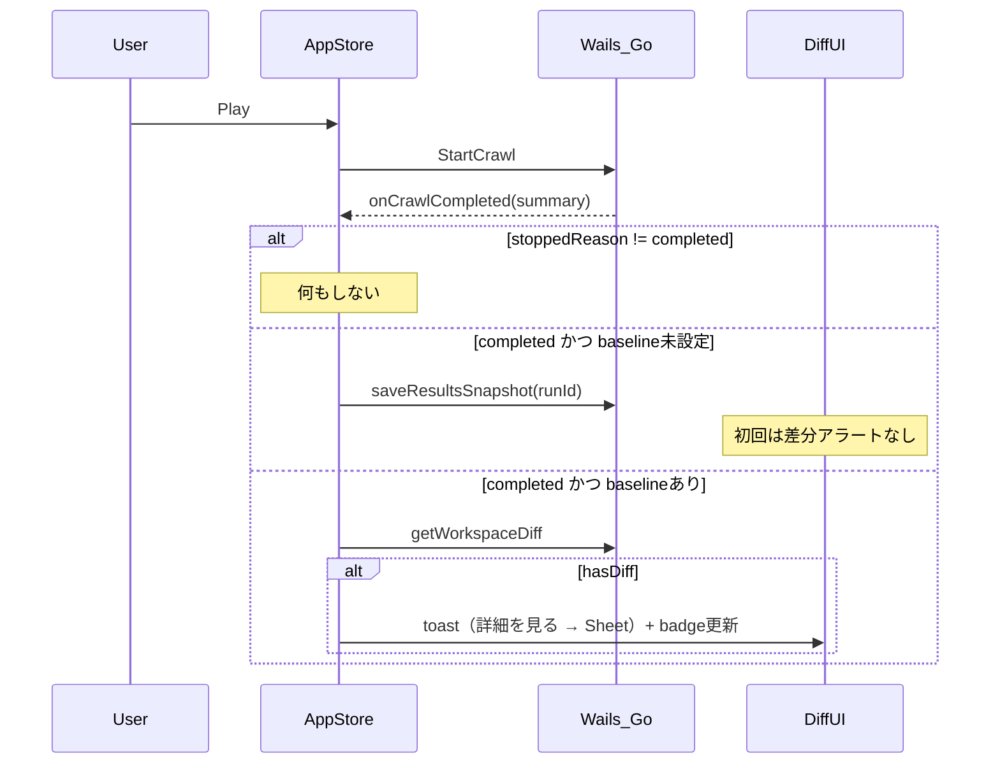

# Phase4 差分 UI 実装プラン

Play 完了 → baseline 対比 → 差分通知 → 詳細ビューアの一連フローを実装する。元プラン（`phase4_diff_ui_9d5c53d6.plan.md`）を構成整理し、実コードと照合した不正確箇所を修正済み。

## 確定方針（grill-me、全て再確認済み）

- baseline: 初回 Play 完了で **自動設定**。2回目以降は変更がある限り差分検出
- 発動条件: crawl が **`completed`** のときのみ（`stopped` / `error` はスキップ）
- 通知: **toast のみ**。「詳細を見る」アクションで Sheet を手動オープン（自動オープンなし）
- LeftSidebar: WS 行に **`GitCompare` 専用ボタン新規追加** + 件数 Badge
- baseline 手動更新: **MenuBar のみ**
- 差分ライブラリ: **react-diff-viewer-continued**（実装時に React19 互換を確認）
- NodeDiffViewer 初期タブ: `kinds` 先頭（Go 側で content→links→fetch 順ソート）
- 差分の持続性: content/links は **baseline 更新までバッジ残存**（`persist_until_baseline`）。fetch は成否が baseline と揃えば自然消滅

## 元プランからの修正点（実コード照合）

- **完了判定の誤り修正**: `CrawlRunSummary` に `status` フィールドは無い。`onCrawlCompleted(summary)` の `summary.stoppedReason === 'completed'` で判定する（[appStore.ts](front/frontend/src/stores/appStore.ts) L1012 付近）
- **baselineRunId のヘッジ削除**: 既に全層に存在（Go `WorkspaceDTO.BaselineRunID`、TS `Workspace.baselineRunId`、`wailsMappers.ts` で hydrate 済み）。DTO 追加作業は不要
- **GitCompare 明確化**: 現状は Dropdown メニュー項目のみ。WS 行内の独立ボタンは新規作成
- **既存資産の再利用を明記**: `workspaceDiffCache`・`fetchWorkspaceDiff`（appStore L1348 付近）、`saveResultsSnapshot`（adapter / ScraperPort、appStore action は未存在）、`WorkspaceDiff` 型は既存。LeftSidebar の既存 JSON Dialog（`setDiffDialogWs`）は DiffSummarySheet に置換

## 適用スキル

- [go-docstring-style](.cursor/skills/go-docstring-style/SKILL.md): `diff.go` の `GetNodeDiffDetail`、`cmd/test/diffsite` の exported 関数・構造体
- [test-overview-style](.cursor/skills/test-overview-style/SKILL.md): `diff_test.go`、`DiffSummarySheet.test.tsx`
- [tsx-i18n-messages](.cursor/skills/tsx-i18n-messages/SKILL.md): 新規 UI の文言・`aria-label`（TSX 直書き禁止）
- design-to-shadcn-css / go-wire: **対象外**（既存 destructive/Badge トークンで足り、diffsite は standalone main で DI 変更なし）

## データフロー



## Phase 1: バックエンド差分詳細 API

現状 `GetWorkspaceDiff` はノード単位 `kinds[]` と `summary` 件数のみ返す。`react-diff-viewer-continued` には old/new 文字列が必要。

新 DTO（[front/internal/model/api.go](front/internal/model/api.go)、既存 `NodeDiffDTO` / `WorkspaceDiffDTO` の隣に追加）:

```go
type DiffPairDTO struct {
    Old string `json:"old"`
    New string `json:"new"`
}
type NodeDiffDetailDTO struct {
    NodeID  string       `json:"nodeId"`
    URL     string       `json:"url"`
    Kinds   []string     `json:"kinds"`   // content→links→fetch 順
    Content *DiffPairDTO `json:"content,omitempty"`
    Links   *DiffPairDTO `json:"links,omitempty"`
    Fetch   *DiffPairDTO `json:"fetch,omitempty"`
}
```

- [front/internal/domain/diff.go](front/internal/domain/diff.go): `GetNodeDiffDetail` 追加。既存 `rowsForRun` / `latestSuccessByNode` / `canonicalLinks` / `fetchState` を流用して old/new ペア生成。go-docstring-style 適用
- [front/internal/usecase/wails_service/store_service.go](front/internal/usecase/wails_service/store_service.go): `GetNodeDiffDetail` 公開（既存 `GetWorkspaceDiff` / `SaveResultsSnapshot` に追従）
- `make bindings`（`wails3 generate bindings -ts`）で再生成
- [front/frontend/src/types/adapter.ts](front/frontend/src/types/adapter.ts): `NodeDiffDetail` 型 + `getNodeDiffDetail` を ScraperPort に追加
- [front/frontend/src/adapters/compositeScraperAdapter.ts](front/frontend/src/adapters/compositeScraperAdapter.ts): Wails 呼び出し実装

## Phase 2: appStore の Play 後フロー

[front/frontend/src/stores/appStore.ts](front/frontend/src/stores/appStore.ts) の `onCrawlCompleted` コールバック内に分岐追加:

1. `summary.stoppedReason !== 'completed'` → 何もしない
2. WS の `baselineRunId` が空 → `scraperPort.saveResultsSnapshot(ws.id, runId)` して return（差分 UI 出さない）
3. baseline あり → `fetchWorkspaceDiff(ws.id)`（既存 action、`workspaceDiffCache` 更新）→ `hasDiff` 時に toast 発動

追加する store フィールド / action:

- `diffSummaryOpen: boolean`（Sheet 開閉）
- `openNodeDiff(nodeId, kind?)`（NodeDiffViewer 起動）
- toast は [lib/notify.tsx](front/frontend/src/lib/notify.tsx) パターン + sonner の action で Sheet を開く
- `workspaceDiffCache` 更新により [CrawlGraph.tsx](front/frontend/src/components/graph/CrawlGraph.tsx) / [UrlNode.tsx](front/frontend/src/components/graph/UrlNode.tsx) の Badge が即反映

## Phase 3: UI コンポーネント

### LeftSidebar 差分通知

[front/frontend/src/components/layout/LeftSidebar.tsx](front/frontend/src/components/layout/LeftSidebar.tsx)。件数定義: `diffCount = diff.nodes.length`（複数 kind でも 1 件）。

- WS 行に `GitCompare` **専用ボタン**を新規追加（Settings/Trash2 横）。`diffCount > 0` 時に shadcn `Badge`（destructive 系、`absolute -top-1 -right-1`）。クリック → `fetchWorkspaceDiff` → DiffSummarySheet
- Dropdown `Menu` トリガー右上に赤丸（`size-2 rounded-full bg-destructive`、件数なし）
- WS 名横の琥珀 `●` は既存維持
- Dropdown 内「差分サマリ」行の琥珀ドットを赤丸に統一
- 既存の JSON Dialog（`setDiffDialogWs`）を DiffSummarySheet 起動に置換
- `diffCount === 0` 時はバッジ・赤丸とも非表示。`aria-label` に件数含める
- 任意: `components/ui/notification-dot.tsx` で赤丸再利用

### DiffSummarySheet（新規）

`front/frontend/src/components/diff/DiffSummarySheet.tsx`

- shadcn `Sheet`（右スライド、グラフを隠さない幅）
- ヘッダ: WS 名 + 3 種サマリ Badge（content N / links N / fetch N）= `WorkspaceDiff.summary`
- ノード一覧: URL + 種別チップ。種別フィルタ Tabs（すべて / content / links / fetch）
- 行クリック → NodeDiffViewer

### NodeDiffViewer（新規）

`front/frontend/src/components/diff/NodeDiffViewer.tsx`

- 実装時に `cd front/frontend && npm install react-diff-viewer-continued`（React19 互換を確認。非互換なら代替検討）。`package.json` / `package-lock.json` をコミット
- shadcn `Dialog` + Tabs（該当 kind のみ表示）。初期タブ = `kinds` 先頭
- `getNodeDiffDetail` で lazy load（Dialog open 時）
- `ReactDiffViewer` に old/new、テーマは `document.documentElement.classList` の dark 判定
- content: markdown 生テキスト（split view）/ links: `JSON.stringify` pretty（sorted）/ fetch: ラベル文字列（i18n）

### UrlNode Badge 強化

[front/frontend/src/components/graph/UrlNode.tsx](front/frontend/src/components/graph/UrlNode.tsx)

- 現状のテキスト Badge（`content`/`links`/`fetch` リテラル）を `FileText` / `Link2` / `AlertCircle` アイコン + Tooltip に変更
- Badge クリック → `openNodeDiff(nodeId, kind)`（`stopPropagation` で選択と分離）

### MenuBar baseline 手動更新

[front/frontend/src/components/layout/MenuBar.tsx](front/frontend/src/components/layout/MenuBar.tsx)

- 「baseline を現在に更新」項目 → `saveResultsSnapshot(ws.id)` → `fetchWorkspaceDiff` → toast。右 SB は変更しない

### i18n

[front/frontend/src/i18n/messages.ts](front/frontend/src/i18n/messages.ts) に `diff: { ... }` 名前空間追加（tsx-i18n-messages 適用）

## Phase 4: 手動確認用テストサイト

目的: Wails App 本体で Play → 差分 UI を確認。専用フロントページ・diff API モック・SQLite シードは作らない。

配置（`front/go.mod` モジュール内、`front/cmd/test/diffsite`、現状未存在）:

```
front/cmd/test/diffsite/
  README.md
  main.go                # -variant=content-a|content-b|links-a|links-b|fetch-a|fetch-b, -addr=:18765
  fixtures/
    content/{a,b}/index.html   # 本文のみ差分（links は a=b）
    links/{a,b}/index.html     # 出リンクのみ差分（本文は a=b）
    fetch/{a,b}/index.html + b/error.html  # /error.html を a=200, b=500
```

フィクスチャ設計ルール:

- content: 本文を変える / `links_json` の出リンクは揃える
- links: `<a href>` URL 集合を変える / 本文（content_hash）は揃える
- fetch: `/error.html` のステータスを変える（a=200, b=500）/ `/` の本文・links は揃える

サーバー仕様:

- `GET /` → `fixtures/{scenario}/{phase}/index.html`
- `GET /error.html` → `fixtures/fetch/{phase}/error.html`（fetch-b のみ 500）
- 静的ファイルのみ。`-variant` の docstring に 6 値を列挙（go-docstring-style）

手動確認フロー（README に 3 シナリオ）。各シナリオ共通: variant `*-a` で 1 回目 Play（baseline）→ 停止 → `*-b` で 2 回目 Play（差分）:

- A. content: `content-a` Play（baseline）→ `content-b` Play → content 差分のみ
- B. links: `links-a` Play → `links-b` Play → links 差分のみ
- C. fetch（任意）: `fetch-a` Play（/, /error.html 両成功）→ `fetch-b` Play → `/error.html` で fetch 差分
- 全シナリオ後: MenuBar「baseline を現在に更新」でバッジ消去
- README 先頭: テスト専用・本番/CI では使わない旨と各 fixture の意図を 1 行ずつ

## Phase 5: 型・ドキュメント・テスト

- [front/frontend/src/types/db.ts](front/frontend/src/types/db.ts): `DbCrawlRun.mode` に `4` 追加（実 DB は migration 000004 で対応済み、TS 側が未同期）、`manually_edited` 追加（migration 000005）
- [docs/api/scraper-ui.md](docs/api/scraper-ui.md): Diff セクションに `GetNodeDiffDetail` 行追加
- Go `diff_test.go`: 3 種分類 + `GetNodeDiffDetail` の old/new（test-overview-style）
- TS `DiffSummarySheet.test.tsx`: summary 件数・バッジ表示
- `cmd/test/diffsite` の `go test`: content/links 各 a≠b、links シナリオで本文同一 等の fixture 制約を検証

## 実装順序

1. Go `GetNodeDiffDetail` + DTO + Wails bindings + ScraperPort/adapter
2. `cmd/test/diffsite` + README（早期に手動確認可能化）
3. `npm install react-diff-viewer-continued` → NodeDiffViewer
4. DiffSummarySheet + LeftSidebar バッジ（JSON Dialog 置換）
5. appStore の `onCrawlCompleted` 分岐 + baseline 自動設定
6. UrlNode Badge + MenuBar baseline 更新
7. 単体テスト + docs/db.ts 同期