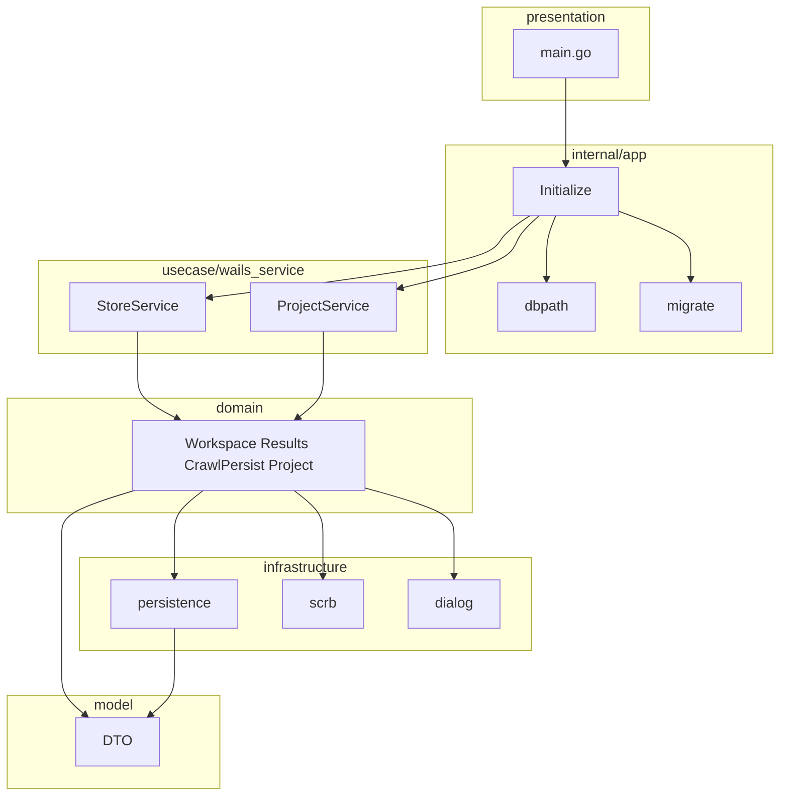

# Phase 2 永続化・.scrb 実装計画（Grill 確定 + API 整合 + レイヤード）

## API 整合性（`docs/api/scraper-ui.md`）

計画と doc の正: [`docs/api/scraper-ui.md`](docs/api/scraper-ui.md)。**実装時に更新**: Phase 表から `MockScraperAdapter` を削除し、現行を `compositeScraperAdapter` + Go `StoreService`/`ProjectService` に合わせる。

| 論点 | 整合後 |
|------|--------|
| Go 公開 | Phase 2: **`StoreService`** + **`ProjectService`**（`usecase/wails_service`）。Phase 3: `ScraperService` |
| `ListWorkspaces` | doc + **`ScraperPort.listWorkspaces`** |
| Crawl 永続化 | StoreService 4 メソッド（Port 外）。`startCrawl` は TS `crawlStub` |
| TS adapter | **`compositeScraperAdapter` のみ**（Mock 廃止） |

---

## Grill / 方針で確定した決定（追記・変更）

| 論点 | 決定 |
|------|------|
| Go 業務ロジック | **`internal/domain`**（旧プランの `usecase/` 本体） |
| Go Wails RPC 薄層 | **`internal/usecase/wails_service`**（`StoreService` / `ProjectService`） |
| **MockScraperAdapter** | **削除**（Vitest 用の残置もしない） |
| TS `adapters/index.ts` | **`scraperPort = compositeScraperAdapter` のみ**（flag / Wails 未接続フォールバックなし） |
| ログ | **`internal/logger`**（backend [`internal/logger`](backend/internal/logger/logger.go) と同 API の `slog` ラッパ） |

---

## レイヤードアーキテクチャ（`front/internal/`）

**依存の向き**: `main` → `app`（Wire）→ **`usecase/wails_service`** → **`domain`** → `model` ＋ `infrastructure/persistence`。

| 層 | 責務 |
|----|------|
| `logger` | `slog` 標準ロガー初期化（`Init` / `InitDefault` / `NewHandler`）。横断利用 |
| `model` | DTO・DB 行 struct（TS `db.ts` と整合） |
| `domain` | ビジネスロジック（WS CRUD、settings、results、diff、crawl 永続化オーケスト、.scrb import/export ロジック） |
| `infrastructure` | リポジトリ（interface+実装）、`scrb` ZIP、`dialog` |
| `usecase/wails_service` | Wails 公開メソッドのみ。**domain へ委譲**（ロジックを書かない） |
| `app` | Wire、dbpath、migrate、起動設定 |

`internal/wails/` パッケージは**使わない**。

### `internal/app`（composition root 周辺）

| ファイル（例） | 役割 |
|----------------|------|
| `config.go` | データディレクトリ・DB ファイル名 |
| `dbpath_dev.go` / `dbpath_prod.go` | build tag で `data/` vs アプリデータ領域 |
| `migrate.go` + `migrations/` | embed + `Up`（DDL の正は [`front/storage/schema.sql`](front/storage/schema.sql)） |
| `providers.go` | `ProvideDB`、`Provide*Repo`、`Provide*Domain`、`ProvideStoreService` / `ProvideProjectService` |
| `wire.go` / `wire_gen.go` | Wire |

### ディレクトリ一覧

```
front/
  internal/
    logger/                   # backend/internal/logger と同構成（slog TextHandler）
      logger.go
    model/
    domain/
      appconfig.go
      workspace.go
      settings.go
      results.go
      diff.go
      crawlpersist.go
      project.go              # .scrb ロジック（scrb + repo 利用）
    usecase/
      wails_service/
        store_service.go      # Wails StoreService → domain
        project_service.go    # Wails ProjectService → domain
    infrastructure/
      persistence/
        repository.go         # interface
        workspace.go          # GORM + Gen
        ...
      scrb/
      dialog/
    app/
      app.go                  # Application { StoreService, ProjectService, cleanup }
      providers.go
      wire.go / wire_gen.go
  storage/schema.sql
  tools/gen/
```



### リポジトリ（`infrastructure/persistence`）

interface と GORM 実装は**インフラ層**。`domain` が `persistence.WorkspaceRepository` 等を受け取る（Wire 注入）。

### `internal/logger`

backend の [`logger.go`](backend/internal/logger/logger.go) を **`scraperbot-front` 用に同等実装**（モジュール共有はしない）。

| API | 用途 |
|-----|------|
| `Init(w, level)` | `slog.SetDefault` |
| `InitDefault()` | `os.Stderr` + `Info` |
| `NewHandler(w, level)` | テスト用 |

- **起動**: `main` で `app.Initialize` より前に `logger.Init`（レベルは build tag や `app/config` から渡してよい）
- **利用**: 各層は `slog.Info` / `slog.Error` 等の標準 API。Wire には載せない（backend CLI と同様）

---

## Wire（`front/internal/app`）

[`go-wire` SKILL](.cursor/skills/go-wire/SKILL.md) に従う。`Application` は Wails 登録用に **`StoreService` / `ProjectService`（wails_service パッケージ）** のみ公開。

```go
// main.go（概念）
logger.Init(os.Stderr, slog.LevelInfo)
app, cleanup, err := app.Initialize(ctx)
defer cleanup()
application.NewService(app.StoreService)
application.NewService(app.ProjectService)
```

`Provide*` 例: `ProvideDB` → repos → `ProvideWorkspaceDomain` → `ProvideStoreService(domainDeps)`。

---

## TypeScript 側

### Mock 削除（必須）

| 対象 | 作業 |
|------|------|
| [`mockScraperAdapter.ts`](front/frontend/src/adapters/mockScraperAdapter.ts) | **削除** |
| [`mockScraperAdapter.test.ts`](front/frontend/src/adapters/mockScraperAdapter.test.ts) | **削除**（必要なら `ScraperPort` を `vi.fn()` した store テストへ移行） |
| [`adapters/index.ts`](front/frontend/src/adapters/index.ts) | `export const scraperPort = compositeScraperAdapter` のみ |
| [`appStore.ts`](front/frontend/src/stores/appStore.ts) | `mockScraperAdapter` import / `syncFromUi` / 直 `saveWorkspace` を **`scraperPort` 経由に統一** |

`VITE_USE_MOCK_ADAPTER` や Wails 未接続時の Mock フォールバックは**設けない**。

### `compositeScraperAdapter`

- `ScraperPort` 実装（Store bindings + `crawlStub`）
- crawl 永続化 4 メソッドは bindings 直呼び（旧 Mock `startCrawl` と同タイミング）

### `ScraperPort` 追記

```ts
listWorkspaces(): Promise<{ id: string; name: string; updatedAt: string }[]>;
```

### `appStore.bootstrap`

`listWorkspaces` → 各 `loadWorkspace` → `updatedAt` 最大をアクティブ。

---

## 実装順序（推奨）

1. `internal/logger`（backend 同等）
2. `internal/model` + `app/migrations`（schema.sql 反映）
3. `internal/app`: dbpath + migrate + `ProvideDB`
4. `infrastructure/persistence`（Gen + repos）
5. `internal/domain` + domain テスト
6. `usecase/wails_service` + Wire + `main`（先頭で `logger.Init`）登録
7. TS: Mock 削除 + composite + `listWorkspaces` + bootstrap/debounce
8. crawl 永続化接続 + `scrb-v1.md` + MenuBar
9. doc 更新（`scraper-ui.md` Mock 除去）+ 手動確認

---

## 完了条件

1. 再起動後 WS・設定・crawl 結果が SQLite から復元される
2. `.scrb` 往復（新規 WS import / アクティブ export）
3. `scraper-ui.md` と実装が一致（Mock 記述なし）
4. `wire_gen.go` コミット済み、`domain` / `wails_service` / `app` の依存向きが上記どおり
5. リポジトリに `mockScraperAdapter.ts` が存在しない

---

## リスク・注意

- **Vitest**: adapter 実装テストは Port モックまたは domain 相当の TS pure 関数テストに寄せる
- **Gen と schema.sql**: migrate の正は `schema.sql`
- **build tag**: dev で `data/` を使う手順を README / Taskfile に記載
