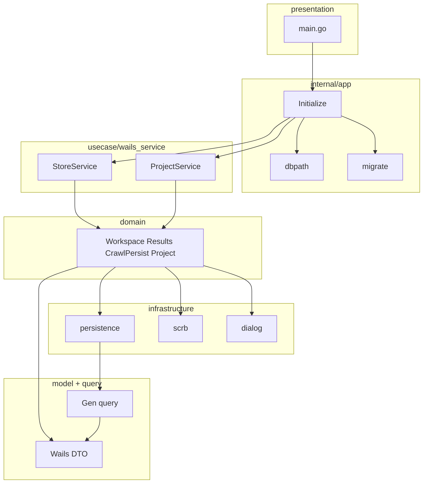

# Phase 2 永続化・.scrb 実装計画（Grill 確定 + API 整合 + レイヤード）

## API 整合性（`docs/api/scraper-ui.md`）

計画と doc の正: [`docs/api/scraper-ui.md`](docs/api/scraper-ui.md)。**実装時に更新**: Phase 表から `MockScraperAdapter` を削除し、現行を `compositeScraperAdapter` + Go `StoreService`/`ProjectService` に合わせる。

| 論点 | 整合後 |
|------|--------|
| Go 公開 | Phase 2: **`StoreService`** + **`ProjectService`**（`usecase/wails_service`）。Phase 3: `ScraperService` |
| `ListWorkspaces` | doc + **`ScraperPort.listWorkspaces`** |
| Crawl 永続化 | StoreService 4 メソッド（Port 外）。`startCrawl` は TS `crawlStub` |
| TS adapter | **`compositeScraperAdapter` のみ**（Mock 廃止） |

---

## 依存ライブラリ（明示）

DB 系はローカル参考実装 [`tmp/db-sample`](tmp/db-sample)（`.gitignore` 対象）と**同じモジュール・バージョン**を `front/go.mod` に導入する。方針の詳細は db-sample の README に記載。

### Go モジュール（`front/go.mod`）

| 用途 | モジュール | バージョン |
|------|-----------|------------|
| SQLite ドライバ（GORM、**CGO 不要**） | `github.com/glebarez/sqlite` | **v1.11.0** |
| ORM | `gorm.io/gorm` | **v1.31.1** |
| 型安全クエリ生成 | `gorm.io/gen` | **v0.3.28** |
| Gen 付属 | `gorm.io/plugin/dbresolver` | **v1.6.2** |
| スキーママイグレーション（**ランタイム**） | `github.com/golang-migrate/migrate/v4` | **v4.19.1** |
| DI（composition root） | `github.com/google/wire` | **v0.7.0**（[`backend/go.mod`](backend/go.mod) と同版） |

```powershell
cd front
go get github.com/glebarez/sqlite@v1.11.0
go get gorm.io/gorm@v1.31.1
go get gorm.io/gen@v0.3.28
go get gorm.io/plugin/dbresolver@v1.6.2
go get github.com/golang-migrate/migrate/v4@v4.19.1
go get github.com/google/wire@v0.7.0
```

### 開発用 CLI（`go install`、db-sample と同手順）

| ツール | コマンド |
|--------|----------|
| migrate CLI | `go install github.com/golang-migrate/migrate/v4/cmd/migrate@latest` |
| GORM Gen | `go install gorm.io/gen/tools/gentool@latest` |
| Wire | `go install github.com/google/wire/cmd/wire@latest` |

- 接続 URL は **`sqlite://<path>`**（pure Go / `modernc.org/sqlite`）。**`sqlite3://`（CGO）は使わない。**
- golang-migrate **v4.19.1** の `database/sqlite` は `modernc.org/sqlite` をデフォルト採用のため、**`-tags sqlite` ビルドタグは不要**（db-sample README の記述は旧版向け。本プロジェクトでは付けない）。
- GORM は `github.com/glebarez/sqlite`（同上、CGO 不要）。

### GORM Gen 出力（db-sample 準拠）

| パス | 内容 | 手編集 |
|------|------|--------|
| `internal/model/*.gen.go` | Gen 生成 struct | **禁止** |
| `internal/query/` | Gen 生成 Query API | **禁止** |
| `tools/gen/main.go` | Gen エントリ（`OutPath: ./internal/query`, `ModelPkgPath: model`） | 設定のみ |

`ModelPkgPath` は `OutPath` の親基準のため `"model"` と指定する（`"./internal/model"` だと `internal/internal/model` になる）。db-sample `tools/gen/main.go` 参照。

Wails 公開 DTO（bindings 用）は `internal/model/api.go` 等の**手書きファイル**に分離し、`.gen.go` と混在させない。

### 標準ライブラリのみ（追加 `go get` 不要）

| 用途 | パッケージ |
|------|-----------|
| .scrb ZIP | `archive/zip`, `encoding/json`, `io` |
| migrate SQL embed | `embed`, `io/fs` |
| ログ | `log/slog`（`internal/logger` ラッパ） |

### `tools.go`（db-sample 同様、CLI 用 blank import）

```go
//go:build tools

package tools

import (
	_ "github.com/golang-migrate/migrate/v4/database/sqlite"
	_ "github.com/golang-migrate/migrate/v4/source/file"
)
```

---

## golang-migrate 起動時適用（毎回）

**方針**: アプリ起動のたびに DB バージョンを確認し、未適用マイグレーションがあれば自動で `Up` する。テーブル存在チェックや初回のみの手動 `Exec` は**使わない**。

| 項目 | 内容 |
|------|------|
| スキーマの正（運用） | `internal/app/migrations/*.sql`（golang-migrate 形式の `NNNNNN_description.up.sql` / `.down.sql`） |
| スキーマの正（参照） | [`front/storage/schema.sql`](front/storage/schema.sql) — migrations と**内容を一致**させる。変更時は migrations を先に追加し schema.sql を追随 |
| 適用タイミング | `app.Initialize` 内、`ProvideDB`（GORM 接続）**より前**に `RunMigrations(dbPath)` |
| 適用 API | `migrate.NewWithSourceInstance` + **`m.Up()`** |
| 最新済み | `migrate.ErrNoChange` は正常終了（毎起動で想定） |
| 接続 URL | `sqlite://` + 絶対パス（db-sample と同じ） |
| SQL ソース | `//go:embed migrations/*.sql` + `source/iofs` |

```go
// internal/app/migrate.go（概念）
//go:embed migrations/*.sql
var migrationFS embed.FS

func RunMigrations(dbPath string) error {
    // 1. data ディレクトリを作成
    // 2. iofs.New(migrationFS, "migrations")
    // 3. migrate.NewWithSourceInstance("iofs", source, "sqlite://"+dbPath)
    // 4. m.Up() — 未適用分のみ適用。ErrNoChange は無視
    // 5. m.Close()
}
```

blank import（ランタイム）:

```go
import (
    "github.com/golang-migrate/migrate/v4"
    _ "github.com/golang-migrate/migrate/v4/database/sqlite"
    "github.com/golang-migrate/migrate/v4/source/iofs"
)
```

開発時の手動確認（db-sample Makefile 同様）:

```powershell
migrate -path internal/app/migrations -database "sqlite://data/meguri.db" up
migrate -path internal/app/migrations -database "sqlite://data/meguri.db" version
```

スキーマ変更フロー（db-sample README 準拠）:

1. `migrations/` に新しい `.up.sql` / `.down.sql` を追加
2. 開発 DB で `migrate ... up` またはアプリ起動で適用
3. `tools/gen/main.go` の `GenerateModel(...)` を更新（必要なら）
4. `go run ./tools/gen` で `internal/model` / `internal/query` 再生成
5. `schema.sql` を追随更新
6. `infrastructure/persistence` / `domain` を更新

---

## Grill / 方針で確定した決定（追記・変更）

| 論点 | 決定 |
|------|------|
| Go 業務ロジック | **`internal/domain`**（旧プランの `usecase/` 本体） |
| Go Wails RPC 薄層 | **`internal/usecase/wails_service`**（`StoreService` / `ProjectService`） |
| **MockScraperAdapter** | **削除**（Vitest 用の残置もしない） |
| TS `adapters/index.ts` | **`scraperPort = compositeScraperAdapter` のみ**（flag / Wails 未接続フォールバックなし） |
| ログ | **`internal/logger`**（backend [`internal/logger`](backend/internal/logger/logger.go) と同 API の `slog` ラッパ） |

---

## レイヤードアーキテクチャ（`front/internal/`）

**依存の向き**: `main` → `app`（Wire）→ **`usecase/wails_service`** → **`domain`** → `model` ＋ `infrastructure/persistence`。

| 層 | 責務 |
|----|------|
| `logger` | `slog` 標準ロガー初期化（`Init` / `InitDefault` / `NewHandler`）。横断利用 |
| `model` | Wails 公開 DTO（手書き）+ Gen 生成 DB struct（`*.gen.go`、**手編集禁止**） |
| `query` | GORM Gen 生成クエリ（**手編集禁止**） |
| `domain` | ビジネスロジック（WS CRUD、settings、results、diff、crawl 永続化オーケスト、.scrb import/export ロジック） |
| `infrastructure` | リポジトリ（interface+実装）、`scrb` ZIP、`dialog` |
| `usecase/wails_service` | Wails 公開メソッドのみ。**domain へ委譲**（ロジックを書かない） |
| `app` | Wire、dbpath、migrate、起動設定 |

`internal/wails/` パッケージは**使わない**。

### `internal/app`（composition root 周辺）

| ファイル（例） | 役割 |
|----------------|------|
| `config.go` | データディレクトリ・DB ファイル名 |
| `dbpath_dev.go` / `dbpath_prod.go` | build tag で `data/` vs アプリデータ領域 |
| `migrate.go` + `migrations/` | embed + **golang-migrate `Up`（起動のたびにバージョン確認・適用）**。DDL 運用の正は `migrations/`、参照の正は [`front/storage/schema.sql`](front/storage/schema.sql) |
| `providers.go` | `ProvideDB`、`Provide*Repo`、`Provide*Domain`、`ProvideStoreService` / `ProvideProjectService` |
| `wire.go` / `wire_gen.go` | Wire |

### ディレクトリ一覧

```
front/
  internal/
    logger/                   # backend/internal/logger と同構成（slog TextHandler）
      logger.go
    model/
      api.go                  # Wails DTO（手書き）
      *.gen.go                # GORM Gen 生成（手編集禁止）
    query/                    # GORM Gen 生成（手編集禁止）
    domain/
      appconfig.go
      workspace.go
      settings.go
      results.go
      diff.go
      crawlpersist.go
      project.go              # .scrb ロジック（scrb + repo 利用）
    usecase/
      wails_service/
        store_service.go      # Wails StoreService → domain
        project_service.go    # Wails ProjectService → domain
    infrastructure/
      persistence/
        repository.go         # interface
        gorm_store.go         # query.Use(db) + clause.OnConflict 等（db-sample store パターン）
        ...
      scrb/
      dialog/
    app/
      app.go                  # Application { StoreService, ProjectService, cleanup }
      providers.go
      wire.go / wire_gen.go
  storage/schema.sql          # 参照用 DDL（migrations と同期）
  tools/gen/main.go           # GORM Gen エントリ
  tools.go                    # migrate CLI 用 blank import（//go:build tools）
```



### リポジトリ（`infrastructure/persistence`）

interface と GORM 実装は**インフラ層**。`domain` が `persistence.WorkspaceRepository` 等を受け取る（Wire 注入）。

実装は db-sample の `internal/store/item.go` パターンに従う:

- `query.Use(db)` で Gen Query を取得
- `WithContext(ctx)` + `field` 式で型安全な SELECT
- `clause.OnConflict` で SQLite upsert

`ProvideDB` は `github.com/glebarez/sqlite` で GORM を開く（migrate 適用**後**）。

### `internal/logger`

backend の [`logger.go`](backend/internal/logger/logger.go) を **`meguri` 用に同等実装**（モジュール共有はしない）。

| API | 用途 |
|-----|------|
| `Init(w, level)` | `slog.SetDefault` |
| `InitDefault()` | `os.Stderr` + `Info` |
| `NewHandler(w, level)` | テスト用 |

- **起動**: `main` で `app.Initialize` より前に `logger.Init`（レベルは build tag や `app/config` から渡してよい）
- **利用**: 各層は `slog.Info` / `slog.Error` 等の標準 API。Wire には載せない（backend CLI と同様）

---

## Wire（`front/internal/app`）

[`go-wire` SKILL](.cursor/skills/go-wire/SKILL.md) に従う。`Application` は Wails 登録用に **`StoreService` / `ProjectService`（wails_service パッケージ）** のみ公開。

```go
// main.go（概念）
logger.Init(os.Stderr, slog.LevelInfo)
app, cleanup, err := app.Initialize(ctx)
defer cleanup()
application.NewService(app.StoreService)
application.NewService(app.ProjectService)
```

`Provide*` 例: `RunMigrations(dbPath)` → `ProvideDB`（glebarez/sqlite）→ repos → `ProvideWorkspaceDomain` → `ProvideStoreService(domainDeps)`。

---

## `front/README.md` と `front/Makefile`

Phase 2 実装と同時に、Wails テンプレート由来の README / Makefile を**本プロジェクト用に差し替える**。開発者が「何をいつ生成するか」「生成物はどこに出るか」を README だけで追えるようにする。

### `front/Makefile`（必須ターゲット）

既存の Wails / frontend ターゲット（`dev`, `build`, `test` 等）は維持し、以下を追加する。

| ターゲット | コマンド概要 | 用途 |
|-----------|-------------|------|
| `tools` | `go install` migrate / gentool / wire | 開発 CLI の導入 |
| `migrate-up` | `migrate -path $(MIGRATIONS_PATH) -database sqlite://$(DB) up` | 手動マイグレーション適用 |
| `migrate-down` | `migrate ... down 1` | 1 段ロールバック（開発用） |
| `migrate-version` | `migrate ... version` | 現在の DB バージョン確認 |
| `gen` | `go run ./tools/gen` | GORM Gen（**マイグレーション適用後**に実行） |
| `wire` | `cd internal/app && go run github.com/google/wire/cmd/wire` | `wire_gen.go` 再生成 |
| `bindings` | `wails3 generate bindings -ts` | TS bindings 再生成（既存 `generate` を統合またはエイリアス） |

Makefile 変数（例）:

| 変数 | 既定値 | 説明 |
|------|--------|------|
| `DB` | `data/meguri.db` | 開発用 SQLite パス（`.gitignore`） |
| `MIGRATIONS_PATH` | `internal/app/migrations` | golang-migrate SQL ディレクトリ |
| `MIGRATE_DATABASE` | `sqlite://$(DB)` | migrate CLI 接続 URL |

### `front/README.md`（必須記載）

README は日本語で、最低限次の章を持つ。

#### 1. 概要・前提

- プロジェクト構成（`internal/` レイヤード、`frontend/`）
- 前提ツール: Go, Node, `wails3`, `make tools` で入る migrate / gentool / wire
- SQLite は CGO 不要（`glebarez/sqlite` + golang-migrate の `modernc.org/sqlite`）。**`-tags sqlite` は付けない**

#### 2. マイグレーション

| 項目 | 内容 |
|------|------|
| SQL の正（運用） | `internal/app/migrations/*.sql` |
| SQL の正（参照） | `storage/schema.sql` |
| 起動時 | `app.Initialize` → `RunMigrations` → `m.Up()`（毎回バージョン確認） |
| 手動適用 | `make migrate-up` |
| バージョン確認 | `make migrate-version` |
| 生成される DB ファイル | `data/meguri.db`（dev、`dbpath_dev`）— **git 管理外** |
| migrate が作るメタ | DB 内 `schema_migrations` テーブル（ファイルではない） |

初回セットアップ手順を番号付きで記載:

1. `make tools`
2. `make migrate-up`（またはアプリ起動で自動適用）
3. `make gen`

スキーマ変更時: migrations 追加 → `migrate-up` → `gen` → `schema.sql` 追随 → persistence/domain 更新。

#### 3. Wails bindings（TS）

| 項目 | 内容 |
|------|------|
| コマンド | `make bindings`（`wails3 generate bindings -ts`） |
| トリガー | `usecase/wails_service` の公開メソッド・`internal/model` の DTO 変更後 |
| 生成先ルート | `frontend/bindings/` |

**生成されるファイル（手編集禁止）**:

| パス | 内容 |
|------|------|
| `frontend/bindings/meguri/index.ts` | サービス export 集約 |
| `frontend/bindings/meguri/internal/usecase/wails_service/storeservice.ts` | `StoreService` RPC |
| `frontend/bindings/meguri/internal/usecase/wails_service/projectservice.ts` | `ProjectService` RPC |
| `frontend/bindings/meguri/internal/usecase/wails_service/index.ts` | 上記 re-export |
| `frontend/bindings/meguri/internal/model/models.ts` | Go DTO の TS 型 |
| `frontend/bindings/meguri/internal/model/index.ts` | model re-export |
| `frontend/bindings/github.com/wailsapp/wails/v3/internal/eventcreate.ts` | Wails イベント登録 |
| `frontend/bindings/github.com/wailsapp/wails/v3/internal/eventdata.d.ts` | イベント型 |
| `frontend/bindings/encoding/json/` | `json.RawMessage` 等を使う場合の型 |

TS 側は `compositeScraperAdapter` が上記 bindings を import する。

#### 4. スキーマ生成（GORM Gen）

| 項目 | 内容 |
|------|------|
| コマンド | `make gen`（`go run ./tools/gen`） |
| 前提 | **マイグレーション済み**の `$(DB)` を `tools/gen/main.go` が参照 |
| 設定 | `OutPath: ./internal/query`, `ModelPkgPath: model` |

**生成されるファイル（手編集禁止）**:

| パス | 内容 |
|------|------|
| `internal/model/*.gen.go` | テーブル行 struct（例: `workspaces.gen.go`） |
| `internal/query/gen.go` | Query エントリ・`Use(db)` |
| `internal/query/*.gen.go` | テーブル別型安全クエリ（例: `workspaces.gen.go`） |

**手書き（Gen と混在させない）**:

| パス | 内容 |
|------|------|
| `internal/model/api.go` 等 | Wails 公開 DTO（bindings の型元） |

#### 5. Wire 生成

| 項目 | 内容 |
|------|------|
| コマンド | `make wire` |
| 生成物 | `internal/app/wire_gen.go`（**手編集禁止**、コミット対象） |

#### 6. 生成物一覧（まとめ）

| 種別 | コマンド | 出力先 | 手編集 |
|------|----------|--------|--------|
| DB スキーマ | `make migrate-up` / 起動時 `Up` | `data/*.db` + `schema_migrations` | — |
| GORM Gen | `make gen` | `internal/model/*.gen.go`, `internal/query/` | 禁止 |
| Wails bindings | `make bindings` | `frontend/bindings/` | 禁止 |
| Wire | `make wire` | `internal/app/wire_gen.go` | 禁止 |
| DDL 参照 | 手動同期 | `storage/schema.sql` | 可（migrations と一致させる） |

#### 7. よく使うコマンド

`make dev` / `make build` / `make test` / `make check` と、上記 codegen ターゲットを一覧化。

---

## TypeScript 側

### Mock 削除（必須）

| 対象 | 作業 |
|------|------|
| [`mockScraperAdapter.ts`](front/frontend/src/adapters/mockScraperAdapter.ts) | **削除** |
| [`mockScraperAdapter.test.ts`](front/frontend/src/adapters/mockScraperAdapter.test.ts) | **削除**（必要なら `ScraperPort` を `vi.fn()` した store テストへ移行） |
| [`adapters/index.ts`](front/frontend/src/adapters/index.ts) | `export const scraperPort = compositeScraperAdapter` のみ |
| [`appStore.ts`](front/frontend/src/stores/appStore.ts) | `mockScraperAdapter` import / `syncFromUi` / 直 `saveWorkspace` を **`scraperPort` 経由に統一** |

`VITE_USE_MOCK_ADAPTER` や Wails 未接続時の Mock フォールバックは**設けない**。

### `compositeScraperAdapter`

- `ScraperPort` 実装（Store bindings + `crawlStub`）
- crawl 永続化 4 メソッドは bindings 直呼び（旧 Mock `startCrawl` と同タイミング）

### `ScraperPort` 追記

```ts
listWorkspaces(): Promise<{ id: string; name: string; updatedAt: string }[]>;
```

### `appStore.bootstrap`

`listWorkspaces` → 各 `loadWorkspace` → `updatedAt` 最大をアクティブ。

---

## 実装順序（推奨）

1. **`front/README.md` + `front/Makefile`**（本節の必須ターゲット・生成物一覧を実装）
2. **依存導入**: `go get`（上記バージョン固定）+ `make tools`
3. `internal/logger`（backend 同等）
4. `internal/app/migrations/`（schema.sql から `000001_*.up.sql` / `.down.sql` を作成）
5. `internal/app`: dbpath + **`migrate.go`（起動時 `m.Up()`）** + `ProvideDB`（glebarez/sqlite）
6. `make migrate-up` → `make gen` で `internal/model` / `internal/query` 生成
7. `infrastructure/persistence`（Gen query + repos）
8. `internal/domain` + domain テスト
9. `usecase/wails_service` + `make wire` + `make bindings` + `main` 登録
10. TS: Mock 削除 + composite + `listWorkspaces` + bootstrap/debounce
11. crawl 永続化接続 + `scrb-v1.md` + MenuBar
12. doc 更新（`scraper-ui.md` Mock 除去）+ 手動確認

---

## 完了条件

1. 再起動後 WS・設定・crawl 結果が SQLite から復元される
2. `.scrb` 往復（新規 WS import / アクティブ export）
3. `scraper-ui.md` と実装が一致（Mock 記述なし）
4. `wire_gen.go` コミット済み、`domain` / `wails_service` / `app` の依存向きが上記どおり
5. リポジトリに `mockScraperAdapter.ts` が存在しない
6. [`front/README.md`](front/README.md) にマイグレーション・bindings・Gen・生成物パスが記載されている
7. [`front/Makefile`](front/Makefile) に `tools` / `migrate-*` / `gen` / `wire` / `bindings` がある

---

## リスク・注意

- **Vitest**: adapter 実装テストは Port モックまたは domain 相当の TS pure 関数テストに寄せる
- **migrations と schema.sql**: 運用の正は **`migrations/`**（golang-migrate）。`schema.sql` はドキュメント兼 diff 参照。乖離させない
- **起動時 migrate**: `m.Up()` は冪等だが、`.down.sql` の品質とバックアップ方針は別途検討（Phase 2 では up のみ必須）
- **Gen 再実行**: マイグレーション適用後に Gen を回す（db-sample「初回セットアップ」手順）
- **dbpath**: dev で `data/` を使う手順を README / Makefile に記載（`dbpath_dev` / `dbpath_prod` の Go build tag は別件）
