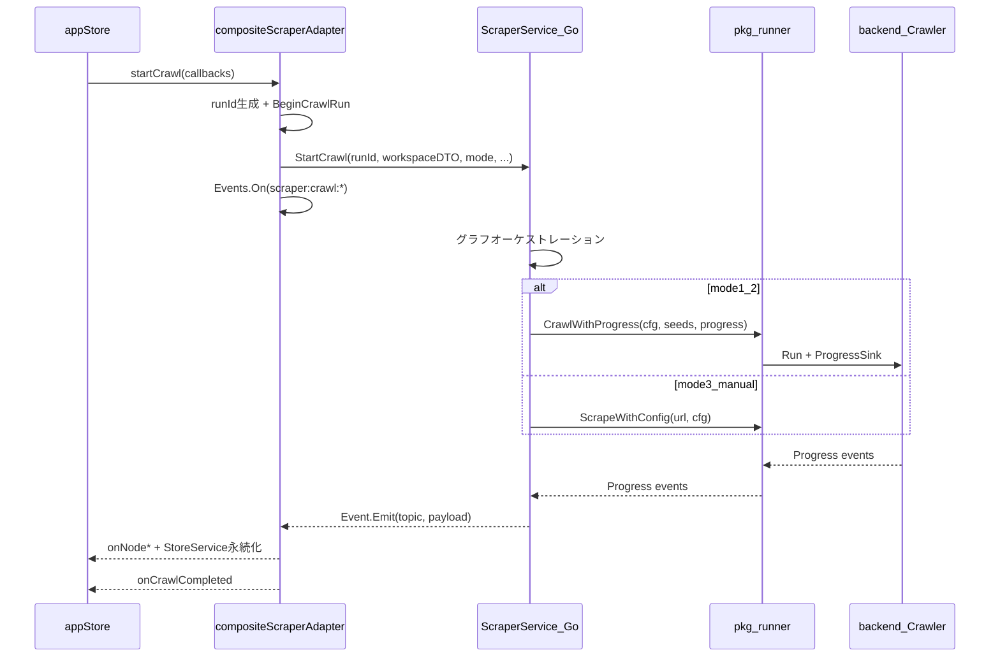
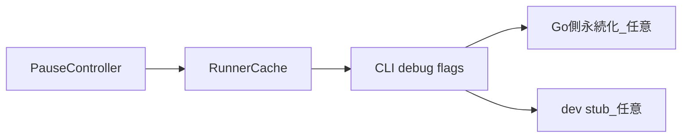

# Phase 3 — backend 統合実装計画（Grill 確定版）

## Grill で確定した決定

| 論点 | 決定 |
|------|------|
| module 境界 | [`backend/pkg/runner`](backend/pkg/runner) に公開ファサード新設（`internal/` は backend 内に閉じる） |
| `ScrapeWithConfig` 戦略 | **案 A**: 呼び出しごとに `Kernel.Init`（v2 で cfg hash キャッシュ） |
| 永続化 | **TS adapter** が `StoreService` RPC + コールバック橋渡し（Go は crawl + Event のみ） |
| `origin: manual` | **v1 に含める**（DDL + manual 後段 scrape） |
| adapter 切替 | **常に real crawler**（`crawlStub` 削除） |
| pause | **v1 は front/ScraperService 側フラグ**（backend `PauseController` は v2） |
| runId | **TS adapter が一元生成** → `BeginCrawlRun` → `StartCrawl(runId)` |
| 実装順 | **3a backend → 3b front** |

---

## 現状サマリ

- Phase 2 完了: [`compositeScraperAdapter`](front/frontend/src/adapters/compositeScraperAdapter.ts) が Store RPC + [`crawlStub`](front/frontend/src/services/crawlStub.ts) で crawl 実行
- Go 側: [`StoreService`](front/internal/usecase/wails_service/store_service.go) / [`ProjectService`](front/internal/usecase/wails_service/project_service.go) のみ。`ScraperService` なし
- backend: BFS [`Crawler.Run`](backend/internal/core/crawler.go) はあるが `ResultSink` のみ。Progress / `exclude_urls` / per-URL Config API なし
- **ブロッカー**: `meguri/internal/...` は `meguri` から import 不可（Go internal ルール）

---

## 目標アーキテクチャ



**責務分割**（[`docs/phase3-backend-gaps.md`](docs/phase3-backend-gaps.md) 準拠）:

| 層 | 担当 |
|----|------|
| backend `pkg/runner` | URL エンジン（BFS / 単体 scrape / Progress emit） |
| front `ScraperService` | グラフオーケストレーション、url↔nodeId、manual 後段、Wails Event 発火 |
| TS adapter | Event 購読 → コールバック + `StoreService` 永続化 |
| `appStore` | FSM + UI 更新（コールバック契約は維持） |

---

## Phase 3a — backend + `pkg/runner`

### 3a-1. Progress 型と Crawler 組み込み

**新規**: `backend/pkg/runner/progress.go`（または `backend/internal/core/progress.go` + pkg で再エクスポート）

```go
type ProgressEvent struct {
    Kind       string // started|succeeded|failed|skipped|linkDiscovered|completed|error
    URL        string
    ParentURL  string // started / linkDiscovered 用
    Depth      int
    Result     *model.Result
    Error      string
    SkipReason string
    Stats      *CrawlStats // completed 用
}
type ProgressSink func(ProgressEvent)
```

**変更**: [`backend/internal/core/crawler.go`](backend/internal/core/crawler.go)

- `job` に `parentURL string` 追加
- `NewCrawler` / `Run` に `ProgressSink` 引数（`ResultSink` は deprecated または Progress 内で統合）
- `runOne`: started → pipeline → succeeded/failed
- `enqueue` / `shouldVisit`: skipped 理由を emit
- リンク発見時: `linkDiscovered` emit
- 完了時: `completed` emit

**変更**: [`backend/internal/usecase/crawl.go`](backend/internal/usecase/crawl.go) — `Run(ctx, targets, progress ProgressSink)`

### 3a-2. `exclude_urls`

**変更**: [`backend/internal/domain/model/config.go`](backend/internal/domain/model/config.go)

```go
ExcludeURLs []string `yaml:"exclude_urls"`
```

- [`backend/internal/core/crawler.go`](backend/internal/core/crawler.go) `shouldVisit` / enqueue 前で正規化 URL 完全一致判定
- `Validate()` 更新
- [`backend/configs/config.example.yaml`](backend/configs/config.example.yaml) に例追加

### 3a-3. `ScrapeWithConfig`（案 A）

**新規**: `backend/pkg/runner/scrape.go`

```go
func ScrapeWithConfig(ctx context.Context, url string, cfg *model.Config, progress ProgressSink) (*model.Result, error)
```

実装:
1. `ProvideHost(cfg)` 相当で Host 生成
2. `core.NewKernel(cfg, host, registry).Init(ctx)`
3. `defer kernel.Close(ctx)`
4. `Pipeline.Run(ctx, url)` → Progress `started` / `succeeded` / `failed`
5. プラグイン登録は [`cmd/meguri/main.go`](backend/cmd/meguri/main.go) と同様の blank import を `pkg/runner` の `init` または `RegisterPlugins()` で集約

### 3a-4. `CrawlWithProgress`

**新規**: `backend/pkg/runner/crawl.go`

```go
func CrawlWithProgress(ctx context.Context, cfg *model.Config, seeds []string, progress ProgressSink) (*core.CrawlStats, error)
```

- 内部で Kernel Init → Crawler 構築 → `Run`
- front から渡される `cfg` はマージ済み（4 層マージは front 側）

### 3a-5. テスト

- `crawler_test.go`: Progress イベント順序、parentUrl、skip 理由
- `exclude_urls` 完全一致
- `pkg/runner` 統合テスト（HTTP fetcher モック or 既存 test doubles）

**3a 完了条件**: `pkg/runner` を CLI サブコマンド or `_test.go` から呼び、Progress NDJSON を検証できること。

---

## Phase 3b — front `ScraperService` + adapter 結線

### 3b-1. module 依存

[`front/go.mod`](front/go.mod):

```
require meguri v0.0.0
```

[`go.work`](go.work) 既存利用で `./backend` を解決。import は **`meguri/pkg/runner` のみ**（`internal/` 直 import 禁止）。

### 3b-2. `GraphNode.origin` + マイグレーション

| ファイル | 変更 |
|---------|------|
| [`front/storage/schema.sql`](front/storage/schema.sql) | `origin TEXT NOT NULL DEFAULT 'crawl' CHECK (origin IN ('crawl','manual'))` |
| `front/internal/app/migrations/000002_origin.up.sql` | 新規 |
| [`front/frontend/src/types/graph.ts`](front/frontend/src/types/graph.ts) | `origin: 'crawl' \| 'manual'` |
| domain / DTO / mappers | `origin` フィールド追加 |
| 手動ノード追加 UI | `origin: 'manual'` をセット |

### 3b-3. Go `ScraperService`

**新規**: [`front/internal/usecase/wails_service/scraper_service.go`](front/internal/usecase/wails_service/scraper_service.go)

```go
type ScraperService struct {
    app *application.App
    mu sync.Mutex
    active *crawlJob // runId, cancel, paused
}

func (s *ScraperService) SetApp(app *application.App)
func (s *ScraperService) StartCrawl(req model.StartCrawlRequest) error  // 非同期 goroutine
func (s *ScraperService) PauseCrawl(runId string) error
func (s *ScraperService) ResumeCrawl(runId string) error
func (s *ScraperService) StopCrawl(runId string) error
```

**`StartCrawlRequest`**（[`front/internal/model/api.go`](front/internal/model/api.go)）に含めるもの:
- `runId`, `workspaceId`, `mode`, `startNodeId`, `nodeIds[]`
- workspace スナップショット: nodes（id, url, origin, nodeSettings, crawlExclude）, edges, seedUrl, exclude_urls, ws/domain settings
- `appDefaults`（JSON）

**オーケストレーション**（[`crawlStub`](front/frontend/src/services/crawlStub.ts) から Go へ移植）:

| モード | 経路 |
|--------|------|
| 1, 2 | `runner.CrawlWithProgress`（seeds + マージ済み cfg）。`linkDiscovered` → 新規 nodeId 割当 → Event `edgeDiscovered` |
| 3 | `getForwardReachableExisting` 相当を Go 実装 → 各 URL に `runner.ScrapeWithConfig` |
| manual 後段 | 本流完了後、`origin=manual` かつ未取得 URL を `ScrapeWithConfig` |

**設定マージ**: Go 側に `mergeConfig` 相当を実装（または TS が URL ごとの cfg を DTO で渡す）。モード 2 は app defaults のみ。

**pause v1**: `crawlJob.paused` フラグ。各 URL 投入前に `waitWhilePaused` 相当。`PauseCrawl` / `ResumeCrawl` RPC で制御。

**Event 発火**（[`docs/api/scraper-ui.md`](docs/api/scraper-ui.md) 同期）:

| topic | payload 主要フィールド |
|-------|----------------------|
| `scraper:crawl:nodeStarted` | workspaceId, runId, nodeId, url |
| `scraper:crawl:nodeSucceeded` | + result (markdown/links/metadata) |
| `scraper:crawl:nodeFailed` | + error |
| `scraper:crawl:nodeSkipped` | + reason |
| `scraper:crawl:edgeDiscovered` | sourceId, targetId, targetUrl |
| `scraper:crawl:completed` | summary (CrawlStats 相当) |
| `scraper:crawl:error` | message |

`application.RegisterEvent` + `wails3 generate bindings` で型安全 Event（推奨）。

### 3b-4. Wire / main 登録

- [`front/internal/app/providers.go`](front/internal/app/providers.go) — `ProvideScraperService`
- [`front/internal/app/app.go`](front/internal/app/app.go) — `ScraperService` フィールド追加
- [`front/main.go`](front/main.go) — サービス登録 + `SetApp(webApp)`（[`ProjectService`](front/internal/usecase/wails_service/project_service.go) と同パターン）

### 3b-5. TS adapter 書き換え

[`compositeScraperAdapter.startCrawl`](front/frontend/src/adapters/compositeScraperAdapter.ts):

1. adapter が `runId` 生成 → `BeginCrawlRun`
2. workspace DTO を組み立て → `ScraperService.StartCrawl`
3. `Events.On('scraper:crawl:*')` で購読（runId でフィルタ）
4. 各 Event で既存の `StoreService` 永続化 + `params.onNode*` 呼び出し（現行 L228-315 のロジックを維持）
5. crawl 完了後 `Events.Off` で購読解除

**削除**:
- [`front/frontend/src/services/crawlStub.ts`](front/frontend/src/services/crawlStub.ts)
- crawlStub 依存テスト（あれば graph/mergeConfig 単体テストは残す）

### 3b-6. `appStore` pause/stop 更新

[`appStore`](front/frontend/src/stores/appStore.ts):
- `pauseCrawl` / `resumeCrawl` → `ScraperService.PauseCrawl` / `ResumeCrawl` を追加呼び出し（ローカル `_paused` は UI 用に維持）
- `stopCrawl` → `ScraperService.StopCrawl` + `AbortController.abort`（Event 購読クリーンアップ用）

### 3b-7. ドキュメント更新

- [`docs/api/scraper-ui.md`](docs/api/scraper-ui.md) — Phase 3 行を現行化、Event topic 一覧、ScraperService RPC 表
- [`docs/phase3-backend-gaps.md`](docs/phase3-backend-gaps.md) — 実装完了項目をチェックオフ

---

## 実行経路まとめ（Grill + gaps 統合）

| 経路 | モード | backend API | front オーケストレーション |
|------|--------|-------------|---------------------------|
| 本流 BFS | 1, 2 | `runner.CrawlWithProgress` | seed 決定、cfg マージ、linkDiscovered → グラフ拡張 |
| 既存ノードのみ | 3 | `runner.ScrapeWithConfig` × N | forward reachable リスト化 |
| manual 後段 | 1, 2, 3 | `runner.ScrapeWithConfig` | 本流後、origin=manual かつ未取得のみ |

---

## リスクと注意

1. **`Kernel.Init` コスト（案 A）**: Chromium 起動が重い。v1 は許容、モード 3 / manual は件数限定。v2 で cfg hash キャッシュ。
2. **pause v1 の限界**: 並行 worker が pause 中も 1 件走り切る可能性あり。UI に tooltip または docs で明示。
3. **新規 URL 発見**: backend BFS が front グラフ外 URL を返す。ScraperService が nodeId 割当 + `edgeDiscovered` Event を正しく発火すること。
4. **runId 二重生成の解消**: adapter 生成 runId を `StartCrawlRequest` に渡し、`appStore` のローカル runId 生成（L865）を adapter 返却値に統一。
5. **プラグイン登録**: `pkg/runner` から backend プラグインが確実に link されるよう、`front/main.go` または `scraper_service.go` で blank import を明示。
6. **`crawlStub` 削除**: E2E は手動確認 + `pkg/runner` テストに寄せる。graph/mergeConfig の既存単体テストは維持。

---

## Phase 3 v2 — v1 後の改善予定

v1 で「動く」ことを優先し、意図的に先送りした項目。Phase 4（UI 改善）とは独立し、**クロール実行品質・パフォーマンス・開発体験**を対象とする。

### v2-1. backend `PauseController`（優先度: 高）

**背景**: v1 の pause は `ScraperService` のオーケストレーションループが次 URL 投入を止めるだけ。モード 1/2 の本流 BFS では `Crawler` の並行 worker が pause 中も手元のジョブを走り切る可能性がある（[`docs/phase3-backend-gaps.md`](docs/phase3-backend-gaps.md) §7）。

**予定**:

| 層 | 変更 |
|----|------|
| `backend/internal/core` | `PauseController` 新設（`Pause()` / `Resume()` / `WaitIfPaused(ctx)`） |
| `backend/internal/core/crawler.go` | worker が dequeue 後・`runOne` 前に `WaitIfPaused` を呼ぶ |
| `backend/pkg/runner` | `CrawlWithProgress` / `ScrapeWithConfig` に controller を注入可能に |
| `front ScraperService` | `PauseCrawl` / `ResumeCrawl` が controller を直接操作（v1 のフラグは廃止または二重化しない） |

**完了条件**: pause 中に新規 fetch が開始されない。resume 後にキューが再開する。stop（ctx cancel）との競合がテストで担保される。

### v2-2. `ScrapeRunner` cfg hash キャッシュ（優先度: 高）

**背景**: v1 は案 A（呼び出しごとに `Kernel.Init`）。モード 3・manual 後段・ノード別設定で Chromium 起動コストが積み上がる。

**予定**:

```go
// backend/pkg/runner/cache.go（案）
type RunnerCache struct { /* cfgHash -> *scrapeRunner */ }
func ScrapeWithConfigCached(ctx, url, cfg, progress) (*model.Result, error)
```

- cfg の正規化 JSON → hash（plugins 構成 + マージ済み設定フィールド）
- 同一 hash は `Kernel` + `Pipeline` を再利用
- TTL / 最大エントリ数 / crawl ジョブ終了時の `Close` を定義
- プラグイン構成が変わったら cache miss で再 Init

**完了条件**: 同一ドメイン設定の連続 scrape で Init 回数が 1 回に抑えられるベンチまたはテスト。

### v2-3. CLI デバッグフラグ（優先度: 中）

**背景**: `pkg/runner` が正規 API だが、backend 単体での検証手段が薄い（[`docs/phase3-backend-gaps.md`](docs/phase3-backend-gaps.md) §8）。

**予定**:

| フラグ | 動作 |
|--------|------|
| `--exclude-url`（繰り返し） | `CrawlConfig.exclude_urls` に注入 |
| `--progress-json` | stderr に Progress を NDJSON 出力（`started` / `succeeded` 等） |

- 既存 CLI [`backend/internal/presentation/cli`](backend/internal/presentation/cli) に追加
- v1 の `pkg/runner` テストと同等のシナリオを手動再現可能にする

### v2-4. 永続化の Go 側集約（優先度: 低・任意）

**背景**: v1 は TS adapter が Event 受信ごとに `StoreService` RPC を呼ぶ。高頻度 crawl で RPC オーバーヘッドと runId 整合の複雑さが残る。

**予定（採用する場合）**:

- `ScraperService` が `CrawlPersistService` を直接呼び、ノード単位の永続化を Go 内で完結
- TS adapter は Event → `appStore` コールバック（UI 更新）のみ
- `BeginCrawlRun` / `FinishCrawlRun` の境界は維持

**判断基準**: v1 運用で RPC 回数・レイテンシが問題になった時点で着手。問題なければ延期可。

### v2-5. 開発用 crawl スタブ復帰（優先度: 低・任意）

**背景**: v1 で `crawlStub` を削除（Grill: always real）。CI や UI 開発でネットワーク不要の経路が欲しくなる可能性。

**予定（採用する場合）**:

- `VITE_USE_CRAWL_STUB` または build tag で `compositeScraperAdapter` が stub / real を切替
- stub は `crawlStub` 相当の軽量 TS 実装（fetch なし）を `services/crawlStub.dev.ts` として復活
- 本番ビルドでは stub コードを tree-shake

### v2 でやらないもの（スコープ外）

| 項目 | 理由 |
|------|------|
| `GraphCrawler` / backend グラフオーケストレーション | Grill 確定: front 担当のまま |
| モード 3 の `Crawler.Run` 化 | R1 方針維持（`ScrapeWithConfig` × N） |
| HTTP REST / SSE 進捗 | Wails デスクトップの正規経路は Event のまま。別フェーズ |
| Phase 4 UI（zundo、差分 UI 拡張等） | [`front_ui_mock_plan`](.cursor/plans/front_ui_mock_plan_5d310e0a.plan.md) Phase 4 参照 |

### v2 実装順（提案）



1. **PauseController** — ユーザー体験に直結
2. **RunnerCache** — パフォーマンス改善
3. **CLI フラグ** — 開発・回帰検証
4. **Go 側永続化 / dev stub** — 必要性を見て判断

---

## 検証計画

**3a**
- [ ] Progress 7 種 + parentUrl が unit test で検証される
- [ ] `exclude_urls` で該当 URL が skipped になる
- [ ] `ScrapeWithConfig` が異なる cfg で 2 URL を順に処理できる

**3b**
- [ ] モード 1: seed から BFS、新規ノード・エッジがグラフに反映
- [ ] モード 2: 選択ノードから app 設定のみで実行
- [ ] モード 3: 既存ノードのみ、新規 URL 無視
- [ ] manual ノード: 本流後に scrape、本流到達済みはスキップ
- [ ] pause / resume / stop が UI と整合
- [ ] crawl run / node_results が SQLite に永続化
- [ ] `origin` が手動追加・リンク発見で正しく保存

**v2（別マイルストーン）**
- [ ] pause 中に worker が新規 fetch を開始しない
- [ ] 同一 cfg hash の連続 scrape で Kernel 再 Init が抑制される
- [ ] `--progress-json` で CLI から Progress NDJSON が得られる
