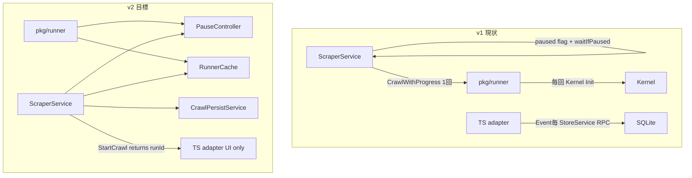
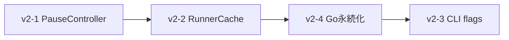

# Phase 3 v2 — 実装計画（Grill 確定版）

## Grill で確定した決定

| 論点 | 決定 |
|------|------|
| pause 中の in-flight | **B** — dequeue 後・`runOne` 前でブロック。実行中 fetch は完了まで許容 |
| PauseController 所有 | **A** — crawl ジョブごとに 1 つ。`ScraperService` が生成・注入。v1 `job.paused` / `waitIfPaused` は廃止 |
| RunnerCache hash | **B** — scrape 関連フィールドのみ（`Targets` / `ExcludeURLs` 除外）。ジョブ終了時に `Close` |
| RunnerCache eviction | **B** — 最大 8 エントリ LRU |
| CLI 経路 | **B** — crawl 時のみ [`pkg/runner`](backend/pkg/runner) 経由 |
| v2 スコープ | 必須 3 項目 + **v2-4 Go 側永続化**（dev stub は含めない） |
| 永続化境界 | **B+** — runId 生成 + `BeginCrawlRun` も Go。`runStarted` Event で TS 通知 |
| FinishCrawlRun | **A** — Go が completed / stopped / error すべてで `FinishCrawlRun` |
| runId フロー | **A** — `StartCrawl` RPC が runId を返す。adapter / appStore は返却値に統一 |

---

## 現状と v2 のギャップ



| 領域 | v1 | v2 変更 |
|------|-----|---------|
| Pause | [`scraper_service.go`](front/internal/usecase/wails_service/scraper_service.go) L121-136 の 100ms ポーリング。Mode 1/2 は BFS 開始前のみ | backend worker レベルでブロック |
| Kernel | [`scrape.go`](backend/pkg/runner/scrape.go) 毎回 Init/Close | 同一 cfg hash で再利用 |
| CLI | internal `app.Crawl.Run`、exclude_urls / progress 未対応 | `CrawlWithProgress` + 2 フラグ |
| 永続化 | [`compositeScraperAdapter.ts`](front/frontend/src/adapters/compositeScraperAdapter.ts) L303-417 が Event ごとに RPC | Go 内完結 + Event は UI 用 |

---

## 実装順序



1. **PauseController** — runner API の土台（cache も同じ `RunOptions` で拡張）
2. **RunnerCache** — Mode 3 / manual の Init コスト削減
3. **Go 永続化** — `StartCrawl` API 変更を含むため adapter 更新と同時
4. **CLI** — 独立。上記完了後に回帰検証用として追加

---

## v2-1. PauseController（優先度: 高）

### backend

**新規** [`backend/internal/core/pause.go`](backend/internal/core/pause.go)

```go
type PauseController struct { /* mu, paused, cond */ }
func NewPauseController() *PauseController
func (p *PauseController) Pause()
func (p *PauseController) Resume()
func (p *PauseController) WaitIfPaused(ctx context.Context) error
```

- `WaitIfPaused`: `ctx.Done()` と `Resume` の両方で解除。stop 優先。
- `pkg/runner` から再エクスポート（front は `scraperbot/pkg/runner` のみ import 可）

**変更** [`backend/internal/core/crawler.go`](backend/internal/core/crawler.go)

- `Crawler` に `pause *PauseController` フィールド追加
- `NewCrawler` に optional pause 引数（または `CrawlerOption` パターン）
- worker loop L264-265: `runOne` **直前**に `pause.WaitIfPaused(ctx)` — ctx cancel 時は worker 終了

**変更** [`backend/pkg/runner`](backend/pkg/runner)

```go
type RunOptions struct {
    Pause *core.PauseController
    Cache *RunnerCache // v2-2 で追加
}
func CrawlWithProgress(ctx, cfg, seeds, progress, opts *RunOptions)
func ScrapeWithConfig(ctx, url, cfg, progress, opts *RunOptions)
```

- `ScrapeWithConfig`: `pipeline.Run` 直前にも `WaitIfPaused`（Mode 3 / manual 対応）
- 既存テスト互換: `opts == nil` で従来動作

**テスト** [`backend/internal/core/pause_test.go`](backend/internal/core/pause_test.go) + crawler 統合

- pause 中は新規 `ProgressStarted` が emit されない
- resume 後にキュー再開
- stop（ctx cancel）と pause の競合: stop が先に効く

### front

**変更** [`front/internal/usecase/wails_service/scraper_service.go`](front/internal/usecase/wails_service/scraper_service.go)

- `activeCrawlJob` から `paused bool` 削除。`pause *runner.PauseController` 追加
- `PauseCrawl` / `ResumeCrawl` → `job.pause.Pause()` / `Resume()`
- `waitIfPaused` 削除。Mode 3 / manual ループの pause チェックも削除（backend に委譲）
- `CrawlWithProgress` / `ScrapeWithConfig` 呼び出しに `&runner.RunOptions{Pause: job.pause}` を渡す

**変更** [`docs/phase3-backend-gaps.md`](docs/phase3-backend-gaps.md) — pause v2 完了をチェック

---

## v2-2. RunnerCache（優先度: 高）

### backend

**新規** [`backend/pkg/runner/cache.go`](backend/pkg/runner/cache.go)

```go
type RunnerCache struct { /* LRU, maxEntries=8 */ }
func NewRunnerCache() *RunnerCache
func (c *RunnerCache) ScrapeWithConfig(ctx, url, cfg, progress, pause) (*model.Result, error)
func (c *RunnerCache) CloseAll()
```

**新規** [`backend/pkg/runner/cfg_hash.go`](backend/pkg/runner/cfg_hash.go)

- scrape 関連サブセットを正規化 JSON → SHA-256
- **含める**: plugins / fetcher / content / pdf / preprocessor / request 設定
- **除外**: `Targets`, `Crawl.ExcludeURLs`, seeds, crawl 巡回パラメータ（`MaxDepth` 等は BFS 専用のため `CrawlWithProgress` 側は引き続き毎回 Init）

**設計メモ**

- `CrawlWithProgress` は v2 でも **毎回 Init**（BFS は 1 cfg で 1 回のため cache 効果小）
- `ScrapeWithConfig` / Mode 3 / manual 後段が主な受益者
- ジョブ終了時: `ScraperService.runCrawl` の `defer cache.CloseAll()`
- eviction 時: 退避エントリの `Kernel.Close` を必ず実行

**テスト** [`backend/pkg/runner/cache_test.go`](backend/pkg/runner/cache_test.go)

- 同一 hash の 2 回 scrape で Init モック回数 1（`Host` / `Kernel` を interface 化するか、init カウンタ付き test double）
- 9 種類の異なる cfg で LRU eviction が Close を呼ぶ

### front

- `runCrawl` 開始時に `runner.NewRunnerCache()` 生成
- `scrapeOneNode` 経路で `cache.ScrapeWithConfig(...)` を使用
- `runMainBFS` は従来 `CrawlWithProgress`（cache なし）

---

## v2-4. Go 側永続化（Grill: B+ / A）

### domain 拡張

**変更** [`front/internal/domain/crawl_persist.go`](front/internal/domain/crawl_persist.go)

- `AppendNodeResult` メソッド追加（[`ResultsService.AppendNodeResultRow`](front/internal/domain/results.go) を委譲）
- `contentHash` 計算を Go に移植（[`contentHash.ts`](front/frontend/src/lib/contentHash.ts) と同一算法: `\r\n` → `\n`, trim, SHA-256 hex）

### ScraperService

**変更** [`front/internal/usecase/wails_service/scraper_service.go`](front/internal/usecase/wails_service/scraper_service.go)

- 依存注入: `CrawlPersistService` + wire 更新（[`providers.go`](front/internal/app/providers.go)）
- `StartCrawl(req) (string, error)` — 戻り値に runId
  1. runId 生成（既存 `uid` 相当を Go で）
  2. `CrawlPersistService.BeginCrawlRun`
  3. `emit("scraper:crawl:runStarted", { workspaceId, runId, mode })`
  4. 非同期 `runCrawl`
- 各 node イベント発火時に **永続化を先に実行** してから Wails Event emit:
  - `nodeStarted` → `PatchGraphNodeStatus(running)`
  - `nodeSucceeded` → `AppendNodeResult` + `PatchGraphNodeStatus(success)`
  - `nodeFailed` → `AppendNodeResult` + `PatchGraphNodeStatus(error)`
  - `nodeSkipped` → `PatchGraphNodeStatus(skipped)`
  - `edgeDiscovered` → `UpsertDiscoveredGraph`
- 終了時 `FinishCrawlRun`:
  - completed → `status=completed` + summary JSON
  - ctx cancel / `StopCrawl` → `status=stopped`
  - error → `status=error` + message

**新規 Event** `scraper:crawl:runStarted` — [`docs/api/scraper-ui.md`](docs/api/scraper-ui.md) に追記

### TS adapter 簡素化

**変更** [`front/frontend/src/adapters/compositeScraperAdapter.ts`](front/frontend/src/adapters/compositeScraperAdapter.ts)

- `uid()` + `BeginCrawlRun` 削除
- Event ハンドラから `StoreService.*` 永続化呼び出しを **すべて削除**
- `const runId = await ScraperService.StartCrawl(...)` で runId 取得
- `onRunStarted(runId)` を RPC 戻り値で即呼び出し（`runStarted` Event は冗長だが UI リアクティブ更新用に購読可）
- `finishRun` 削除（Go 担当）
- `onNode*` / `onCrawlCompleted` / `onCrawlError` コールバックは維持（appStore UI 更新）

**変更** [`front/frontend/src/stores/appStore.ts`](front/frontend/src/stores/appStore.ts)

- ローカル runId 生成があれば adapter 返却値に統一

**bindings** — `StartCrawl` 戻り値型変更後に `wails3 generate bindings` 再実行

---

## v2-3. CLI デバッグフラグ（優先度: 中）

### フラグ追加

**変更** [`backend/internal/presentation/cli/flags.go`](backend/internal/presentation/cli/flags.go)

| フラグ | 型 | 動作 |
|--------|-----|------|
| `--exclude-url` | 繰り返し | `cfg.Crawl.ExcludeURLs` にマージ |
| `--progress-json` | bool | stderr に Progress NDJSON |

### crawl 経路切替

**変更** [`backend/internal/presentation/cli/cli.go`](backend/internal/presentation/cli/cli.go) `runCrawl`

```go
stats, err := runner.CrawlWithProgress(ctx, cfg, cfg.Targets, progressSink, nil)
```

- `progressSink`: `Kind` / `URL` / `ParentURL` / `Depth` / `Error` / `SkipReason` を 1 行 JSON で `os.Stderr` へ
- ファイル出力は v2 では従来どおり internal app 経由の結果保存を維持するか、**progress のみ runner 経由**に留める（最小差分: crawl 実行エンジンのみ runner、結果保存は現状維持でも可 — 実装時に `runCrawl` を runner 完全移行し stats のみログ）

---

## スコープ外（v2 でやらない）

- v2-5 dev crawl stub 復帰
- `GraphCrawler` / backend グラフオーケストレーション
- Mode 3 の `Crawler.Run` 化
- CLI 単体 scrape の `pkg/runner` 統一（crawl のみ）
- Phase 4 UI 改善

---

## 検証計画

**v2-1 PauseController**
- [ ] pause 中に worker が新規 `ProgressStarted` を emit しない
- [ ] in-flight 1 件は完了する（並行度 N なら最大 N 件）
- [ ] resume 後にキューが再開する
- [ ] `StopCrawl` が pause 中でも ctx cancel で終了する

**v2-2 RunnerCache**
- [ ] 同一 cfg hash の連続 scrape で Kernel Init が 1 回
- [ ] 9 種 cfg で LRU eviction + Close
- [ ] ジョブ終了後に cache エントリが残らない

**v2-4 Go 永続化**
- [ ] `StartCrawl` が runId を返す
- [ ] crawl 完了後 SQLite に node_results / graph_nodes.status が正しく保存（adapter 経由 RPC なし）
- [ ] stop 時 `crawl_runs.status = stopped`
- [ ] contentHash が TS 算法と一致（Go/TS 同一入力の golden test）

**v2-3 CLI**
- [ ] `--exclude-url` で skipped が NDJSON に出る
- [ ] `--progress-json` で started / succeeded / completed が stderr に出る

**手動 E2E**
- [ ] Mode 1 BFS: pause → resume → グラフ反映
- [ ] Mode 3: 同一設定ノード連続 scrape の体感速度改善
- [ ] stop 後 UI が idle に戻る

---

## 主要変更ファイル一覧

| ファイル | v2 変更内容 |
|---------|------------|
| [`backend/internal/core/pause.go`](backend/internal/core/pause.go) | 新規 PauseController |
| [`backend/internal/core/crawler.go`](backend/internal/core/crawler.go) | worker 前 WaitIfPaused |
| [`backend/pkg/runner/scrape.go`](backend/pkg/runner/scrape.go) | RunOptions + cache 経路 |
| [`backend/pkg/runner/crawl.go`](backend/pkg/runner/crawl.go) | RunOptions |
| [`backend/pkg/runner/cache.go`](backend/pkg/runner/cache.go) | 新規 LRU cache |
| [`front/internal/usecase/wails_service/scraper_service.go`](front/internal/usecase/wails_service/scraper_service.go) | pause/cache/persist/API 変更 |
| [`front/internal/domain/crawl_persist.go`](front/internal/domain/crawl_persist.go) | AppendNodeResult + contentHash |
| [`front/frontend/src/adapters/compositeScraperAdapter.ts`](front/frontend/src/adapters/compositeScraperAdapter.ts) | UI のみに縮小 |
| [`backend/internal/presentation/cli/flags.go`](backend/internal/presentation/cli/flags.go) | 2 フラグ追加 |
| [`backend/internal/presentation/cli/cli.go`](backend/internal/presentation/cli/cli.go) | crawl → runner |
| [`docs/phase3-backend-gaps.md`](docs/phase3-backend-gaps.md) / [`docs/api/scraper-ui.md`](docs/api/scraper-ui.md) | v2 完了反映 |
