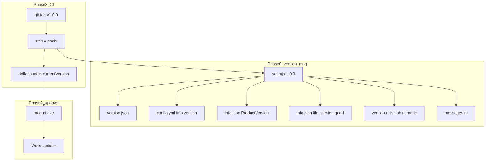

# Meguri Windows リリース + バージョン管理プラン

## Grill で確定した方針

| 項目 | 決定 |
|------|------|
| 範囲 | version-mng（Phase 0）+ windows-release Phase 1〜3 |
| バージョンの正 | [`tools/version-mng/version.json`](tools/version-mng/version.json) |
| スクリプト API | `node set.mjs 1.2.3`（`X.Y.Z` のみ） |
| git tag / `main.currentVersion` | CI が tag から `v` を除去 → `1.0.0` 形式で set.mjs / ldflags に渡す |
| Windows 数値版 | `file_version` / NSIS `VIProductVersion` は core から自動導出（`1.0.0.0`） |
| テスト | スクリプト動作は手動確認（自動テストは今回スコープ外） |

## 現状ギャップ

- UI [`messages.ts`](front/frontend/src/i18n/messages.ts): `0.1.0`
- Wails [`config.yml`](front/build/config.yml) / [`info.json`](front/build/windows/info.json): `0.0.1`
- [`front/main.go`](front/main.go): `currentVersion` 変数・updater 未実装
- [`.github/workflows/`](.github/workflows/): 未作成



---

## Phase 0 — バージョン管理ツール

### 0-1. `tools/version-mng/` 新規作成

```
tools/version-mng/
  package.json      # type: module, 依存: yaml
  version.json      # { "appVersion": "0.0.1", "fileVersion": "0.0.1.0" }
  set.mjs           # メインスクリプト
  README.md         # 使い方 + 手動確認チェックリスト
```

### バージョン形式

`X.Y.Z` のみ（例: `1.0.0`）。`v` 接頭辞・`-beta` 等の suffix は不可。

| 種類 | 例 | 用途 |
|------|-----|------|
| **appVersion** | `1.0.0` | UI / config.yml / ProductVersion / updater / git tag |
| **fileVersion** | `1.0.0.0` | `info.json` の `file_version`、NSIS `VIProductVersion` |

**`set.mjs` の動作:**

1. 引数を `X.Y.Z` として検証
2. `fileVersion` = `X.Y.Z.0`
3. [`version.json`](tools/version-mng/version.json) を更新し、以下へ伝播

| 対象 | 更新箇所 | 設定する値 |
|------|----------|------------|
| [`front/build/config.yml`](front/build/config.yml) | `info.version` のみ | **appVersion**（フル文字列） |
| [`front/build/windows/info.json`](front/build/windows/info.json) | `info.0000.ProductVersion` | **appVersion** |
| 同上 | `fixed.file_version` | **fileVersion**（数値 quad） |
| [`front/frontend/src/i18n/messages.ts`](front/frontend/src/i18n/messages.ts) | `version: '...'` | **appVersion** |
| [`front/build/windows/version-nsis.nsh`](front/build/windows/version-nsis.nsh)（新規・自動生成） | `INFO_PRODUCTVERSION_NUMERIC` | core `major.minor.patch` |

6. 変更ファイルパスを stdout に出力

**NSIS 対応（Phase 0 で実施）:** [`project.nsi`](front/build/windows/nsis/project.nsi) を調整し、`wails_tools.nsh` include 後に `version-nsis.nsh` を読み込み、`VIProductVersion` / `VIFileVersion` は `INFO_PRODUCTVERSION_NUMERIC` を使う。`VIAddVersionKey "ProductVersion"` は従来通り `${INFO_PRODUCTVERSION}`（フル appVersion）。

```nsis
!include "wails_tools.nsh"
!include "..\version-nsis.nsh"
VIProductVersion "${INFO_PRODUCTVERSION_NUMERIC}.0"
VIFileVersion    "${INFO_PRODUCTVERSION_NUMERIC}.0"
VIAddVersionKey "ProductVersion"  "${INFO_PRODUCTVERSION}"
```

**初回実行:** 現状の不整合（`0.0.1` vs `0.1.0`）を `version.json` の初期値で統一する。

### 0-2. [`docs/windows-release.md`](docs/windows-release.md) 追記

新セクション **「バージョン管理」** を追加:

- **デスクトップアプリ版:** `node tools/version-mng/set.mjs 1.0.0` → 上記ファイル同期
- **実行時版（updater 用）:** tag push 時 CI が `v` を除去して `-ldflags "-X main.currentVersion=..."` を付与

**リリース手順（手動 → CI）:**

1. `node tools/version-mng/set.mjs 1.0.0`
2. 変更をコミット（`version-nsis.nsh` 含む）
3. `git tag v1.0.0 && git push origin v1.0.0`
4. CI が set + build + Release 公開

### 0-3. 手動確認チェックリスト（README に記載、実施はユーザー）

- [ ] `node set.mjs 9.9.9` 実行後、表示版が `9.9.9`、`file_version` が `9.9.9.0`
- [ ] `node set.mjs 1.0.0-beta` がエラー終了する
- [ ] `wails3 task windows:package` が NSIS ビルド成功する
- [ ] `config.yml` 先頭 `version: '3'` が変わっていない
- [ ] 不正引数（`abc`, `v1.0.0`）でエラー終了する
- [ ] 確認後、実際の版に戻す

---

## Phase 1 — ビルド・配布（[doc L303-307](docs/windows-release.md)）

- `wails3 task windows:package INSTALL_SCOPE=user` で NSIS ビルド検証
- WebView2 ブートストラッパ動作確認（クリーン VM 推奨）
- Release 資産を手動 1 回試す:
  - `meguri-installer.exe`
  - `meguri-windows-amd64.zip`
  - `SHA256SUMS`（Phase 2/3 で本格化）

**Phase 0 連携:** パッケージ前に `set.mjs` で版を揃え、`info.json` の `ProductVersion` がインストーラに反映されることを確認。

---

## Phase 2 — Updater（[doc L309-314](docs/windows-release.md)）

### 2-1. [`front/main.go`](front/main.go) 変更

```go
var currentVersion = "dev" // CI: -ldflags "-X main.currentVersion=1.0.0"
```

- `updater` + `github` provider 初期化（doc L160-182 準拠）
- `//go:embed updater-key.pub`（鍵は Phase 2 で生成）

### 2-2. UI 連携

- 起動時サイレント `Check` + [`MenuBar.tsx`](front/frontend/src/components/layout/MenuBar.tsx) に「更新を確認…」
- 表示版は引き続き [`messages.ts`](front/frontend/src/i18n/messages.ts)（`set.mjs` で CI と同期済み）

### 2-3. Ed25519 鍵

- `ssh-keygen -t ed25519` → `updater-key.pub` をリポジトリにコミット
- 秘密鍵は GitHub Actions Secret

### 2-4. E2E テスト Release

- `v0.9.0` → `v1.0.0` で updater 動作確認

---

## Phase 3 — CI（[doc L316-319](docs/windows-release.md)）

[`.github/workflows/release-windows.yml`](.github/workflows/release-windows.yml) 新規作成:

```yaml
on:
  push:
    tags: ['v*']
```

**ジョブ手順:**

1. tag から版抽出: `v1.0.0` → `1.0.0`（先頭 `v` のみ除去）
2. `node tools/version-mng/set.mjs $VERSION`（ビルド資産と UI を tag と一致させる）
3. `wails3 task windows:build` with `BUILD_FLAGS` に `-ldflags "-X main.currentVersion=$VERSION"` を追加  
   - 注入先: [`front/build/windows/Taskfile.yml`](front/build/windows/Taskfile.yml) L60 の `BUILD_FLAGS` 変数を拡張
4. `wails3 task windows:package INSTALL_SCOPE=user`
5. updater 用 zip 作成
6. `SHA256SUMS` + Ed25519 署名
7. `softprops/action-gh-release` で公開

**版の役割分担（最終形）:**

| 版の用途 | 設定元 | 更新方法 |
|----------|--------|----------|
| UI 表示 / config / ProductVersion | `version.json` appVersion | `set.mjs`（手動 or CI） |
| exe 数値版 / NSIS VIProductVersion | `version.json` fileVersion（導出） | `set.mjs` → info.json + version-nsis.nsh |
| updater 実行時判定 | `main.currentVersion` | CI ldflags（tag 同期） |

---

## スコープ外（今回やらない）

- Phase 4（Authenticode / ARM64）
- version-mng の自動テスト
- フロントへ Go から動的に版を渡す Wails binding（`messages.ts` 静的更新で十分）
