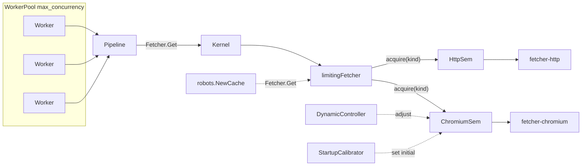

# フェッチ並列上限（静的 + キャリブレーション + 動的調整）

## 背景と目標

現状は [`crawler.go`](backend/internal/core/crawler.go) の `crawl.max_concurrency`（1〜64、既定 4）のみで並列を制御している。ノード／ドメイン設定で `http` / `chromium` が混在し得る一方、Chromium は [`client.go`](backend/plugins/fetcher-chromium/client.go) で **リクエストごとにブラウザを起動**するため、同じ並列数でも OOM リスクが HTTP と桁違いに高い。



**ゴール**

- 2 段階制御: ジョブ全体（既存） + フェッチャ種別（新規）
- Phase 1: 静的な種別別上限
- Phase 2: 起動時キャリブレーションで Chromium 上限をマシン適応
- Phase 3: Chromium のみメモリ水位に応じて動的調整
- 上限適用は **Kernel の `limitingFetcher` デコレータ**経由（Pipeline は変更不要）
- **ブラウザプールは別タスク**（本プランではセマフォのみ。プール実装後は `chromium_max_inflight` = プールサイズに揃える想定をコメントで残す）

---

## 設定スキーマ

[`CrawlConfig`](backend/internal/domain/model/config.go) に `FetchLimits` を追加する（`crawl` 配下で既存 `max_concurrency` と並べる）。

```go
type FetchLimitsConfig struct {
    HTTPMaxInflight     int     `yaml:"http_max_inflight"`      // 既定 16, 範囲 1〜64
    ChromiumMaxInflight int     `yaml:"chromium_max_inflight"`  // 既定 2,  範囲 1〜8
    AutoCalibrate       bool    `yaml:"auto_calibrate"`         // 既定 true
    DynamicChromium     bool    `yaml:"dynamic_chromium"`       // 既定 true
    MemoryHighWatermark float64 `yaml:"memory_high_watermark"`  // 既定 0.80
    MemoryLowWatermark  float64 `yaml:"memory_low_watermark"`   // 既定 0.60
}
```

**Validate ルール**

- `http_max_inflight`: 1〜64（0 は未指定扱い → 既定 16）
- `chromium_max_inflight`: 1〜8（0 は未指定扱い → 既定 2）
- watermark: `0.5 <= low < high <= 0.95`
- `plugins.fetcher == chromium` かつ `max_concurrency > chromium_max_inflight` のとき **警告ログ**（エラーにはしない。ワーカーは待機するだけ）

**DefaultConfig 既定値**

| キー | 値 |
|------|-----|
| `http_max_inflight` | 16 |
| `chromium_max_inflight` | 2 |
| `auto_calibrate` | true |
| `dynamic_chromium` | true |
| `memory_high_watermark` | 0.80 |
| `memory_low_watermark` | 0.60 |

---

## コア実装: `FetchLimiter`

新規パッケージ [`backend/internal/core/fetchlimit/`](backend/internal/core/fetchlimit/) を追加。

### `limiter.go`

- `FetchLimiter` は HTTP / Chromium 用の **可変容量セマフォ**（`sync.Mutex` + `chan struct{}` または counting semaphore）を保持
- API:
  - `NewFromConfig(cfg *model.FetchLimitsConfig) *FetchLimiter`
  - `Acquire(ctx, kind model.FetcherKind) error` — ctx キャンセルで待機解除
  - `Release(kind model.FetcherKind)`
  - `SetChromiumCapacity(n int)` — 動的調整・キャリブレーション用（1〜8 にクランプ）
  - `Close()` — 動的監視 goroutine の停止

### `calibrate.go`（Phase 2）

- ジョブ開始時（`auto_calibrate: true`）に 1 回実行
- **シグネチャ**: `CalibrateChromium(ctx context.Context, lim *FetchLimiter, browserPath string) error`
- **fetchlimit から `plugins/fetcher-chromium` は import しない**。browser path は呼び出し元（runner）が解決済みの文字列を渡す
- 手順:
  1. `browserPath` が空 → 静的既定 2 にフォールバック + `slog.Warn` で return
  2. OS の利用可能メモリを取得（後述 `memprobe`）
  3. 渡された `browserPath` でダミー URL（`about:blank` など）を 1 回起動し、プロセスメモリ増分を計測
  4. `max = floor(available * 0.6 / perInstance)` を算出し `clamp(1, 8)` で `SetChromiumCapacity`
  5. path 解決失敗・計測失敗時も静的既定 2 にフォールバック + `slog.Warn`

**browser path 解決は runner 側の責務**

- [`resolveBrowserPath`](backend/plugins/fetcher-chromium/browser.go) を [`backend/internal/infrastructure/chromium/path.go`](backend/internal/infrastructure/chromium/path.go) に抽出
- `plugins/fetcher-chromium` と `pkg/runner` の両方がこのパッケージを import する
- runner は `cfg.Plugins.FetcherConfig.BrowserPath` + 環境変数 `MEGURI_CHROMIUM_PATH` を `chromium.ResolveBrowserPath` に渡し、得た path を `CalibrateChromium` に渡す

### `dynamic.go`（Phase 3）

- `DynamicChromium: true` のとき、ジョブ単位で 5 秒間隔の goroutine を起動
- `memprobe.UsedRatio()`（使用中メモリ / 総メモリ）を参照:
  - `> high` → Chromium 容量を -1（最小 1）
  - `< low` かつ現在値 < 静的上限 → +1（最大はキャリブレーション結果または設定値）
- **ヒステリシス**（low / high の二重閾値）でジタバタ防止
- HTTP は静的上限のまま（動的調整対象外）

### `memprobe/`（OS メモリ取得）

- 新規 [`backend/internal/core/fetchlimit/memprobe/`](backend/internal/core/fetchlimit/memprobe/)
- `AvailableBytes() (uint64, error)` / `UsedRatio() (float64, error)`
- 実装: `runtime.GOOS` で分岐
  - **windows**: `GlobalMemoryStatusEx`（`golang.org/x/sys/windows`、既存 indirect 依存を利用）
  - **linux/darwin**: `syscall` または `/proc/meminfo`（linux）
- 新規外部依存は追加しない方針

---

## 配線: 上限適用は Kernel の `limitingFetcher` デコレータ

**Pipeline.Run の P3 直前 acquire/release は採用しない。** [`Pipeline.Run`](backend/internal/core/pipeline.go) は既存どおり `p.kernel.Fetcher().Get(...)` を呼ぶだけで変更不要。

### `limitingFetcher`（新規）

- 配置: [`backend/internal/core/limiting_fetcher.go`](backend/internal/core/limiting_fetcher.go)（または `fetchlimit` 内。`plugin.Fetcher` を実装するため `core` パッケージが自然）
- `plugin.Fetcher` を実装するデコレータ:

```go
type limitingFetcher struct {
    inner   plugin.Fetcher
    lim     *fetchlimit.FetchLimiter
    kind    model.FetcherKind
}

func (f *limitingFetcher) Get(ctx context.Context, u *url.URL, headers map[string]string) (*model.Response, error) {
    if err := f.lim.Acquire(ctx, f.kind); err != nil {
        return nil, err
    }
    defer f.lim.Release(f.kind)
    return f.inner.Get(ctx, u, headers)
}
```

- `kind` は `k.cfg.Plugins.Fetcher` から取得（各 Kernel は自身の Config に対応する 1 種別のみ）

### `Kernel.Init` で包む ([`kernel.go`](backend/internal/core/kernel.go))

Fetcher プラグインの `Init` 成功後、`fetchLimiter` が非 nil なら `k.fetcher` を `limitingFetcher` で置き換える:

```go
if err := f.Init(ctx, k.host); err != nil { ... }
if k.fetchLimiter != nil {
    k.fetcher = newLimitingFetcher(f, k.fetchLimiter, k.cfg.Plugins.Fetcher)
} else {
    k.fetcher = f
}
```

- `initialized` スライスには **inner**（プラグイン本体）のみ登録し、`Close` は inner に委譲（limitingFetcher の `Close` は inner へフォワード）
- `robots.NewCache(k.Fetcher())` は limitingFetcher 経由になるため、**robots.txt 取得も自動的に上限対象**（意図的。過剰な robots 並列も抑える）

### `Kernel` フィールド・メソッド

- フィールド `fetchLimiter *fetchlimit.FetchLimiter` を追加
- `SetFetchLimiter(l *fetchlimit.FetchLimiter)` — `Init` 前に呼ぶ（`Init` 内でデコレータ適用）
- `Config()` は既存メソッドをそのまま利用（新規追加不要）

---

## ジョブライフサイクル

[`RunOptions`](backend/pkg/runner/options.go) に `FetchLimiter *fetchlimit.FetchLimiter` を追加。

| エントリポイント | 変更 |
|------------------|------|
| [`crawl.go`](backend/pkg/runner/crawl.go) | `opts.FetchLimiter` が nil なら `NewFromConfig` を生成。`auto_calibrate` 時は `chromium.ResolveBrowserPath` で path 解決 → `CalibrateChromium` → 動的監視開始。`k.SetFetchLimiter` 後に `k.Init` |
| [`scrape.go`](backend/pkg/runner/scrape.go) | 同上（単一 URL でも Chromium 保護） |
| [`cache.go`](backend/pkg/runner/cache.go) | `getOrCreate` で各 Kernel に **同一 limiter 参照**を `SetFetchLimiter`（`Init` 前）。Mode 3 で fetcher 混在時に必須 |
| [`scraper_service.go`](front/internal/usecase/wails_service/scraper_service.go) `runOptions()` | `StartCrawl` 時に limiter を 1 個生成し `RunOptions` に載せる。`defer limiter.Close()` はジョブ終了時（既存 `cache.CloseAll` と同タイミング） |

**browser path 抽出**

- [`backend/internal/infrastructure/chromium/path.go`](backend/internal/infrastructure/chromium/path.go) に `ResolveBrowserPath(configuredPath string) (string, error)` を配置（現 [`browser.go`](backend/plugins/fetcher-chromium/browser.go) から移動）
- `plugins/fetcher-chromium/browser.go` は thin wrapper にし、infrastructure を呼ぶだけにする

CLI ([`flags.go`](backend/internal/presentation/cli/flags.go)) にオプションフラグを追加:

- `--fetch-http-inflight`, `--fetch-chromium-inflight`
- `--no-fetch-auto-calibrate`, `--no-fetch-dynamic-chromium`

---

## フロントエンド / UI 設定

| ファイル | 変更 |
|----------|------|
| [`front/frontend/src/types/config.ts`](front/frontend/src/types/config.ts) | `FetchLimitsConfig` 型追加 |
| [`front/frontend/src/schemas/config.ts`](front/frontend/src/schemas/config.ts) | Zod バリデーション |
| [`front/frontend/src/lib/defaults.ts`](front/frontend/src/lib/defaults.ts) | 既定値 |
| [`front/internal/model/defaults.go`](front/internal/model/defaults.go) | Go 側既定 JSON |
| [`backend/pkg/runner/uiconfig.go`](backend/pkg/runner/uiconfig.go) | UI ↔ model マッピング |
| [`ConfigFormFields.tsx`](front/frontend/src/components/settings/ConfigFormFields.tsx) | Crawl タブに「取得並列」セクション追加（`http_max_inflight`, `chromium_max_inflight`, `auto_calibrate`, `dynamic_chromium`） |
| [`messages.ts`](front/frontend/src/i18n/messages.ts) | ヘルプテキスト（Chromium は重い・既定 2 など） |
| [`config.example.yaml`](backend/configs/config.example.yaml) | サンプル記載 |

**UI UX**

- `fetcher === 'chromium'` 選択時、`max_concurrency` 入力欄の横に注意文を表示（「Chromium 同時取得は別上限で制御されます」）
- `chromium_max_inflight` は fetcher が chromium のときのみ強調表示（http のみ運用時は折りたたみ可）

---

## テスト

| テスト | 内容 |
|--------|------|
| `fetchlimit/limiter_test.go` | acquire/release、容量変更、ctx キャンセル |
| `fetchlimit/dynamic_test.go` | モック memprobe で水位に応じた増減 |
| `fetchlimit/calibrate_test.go` | `browserPath` 空・計測失敗時のフォールバック（実ブラウザは `t.Skip`） |
| `limiting_fetcher_test.go` | 遅延 inner スタブで同時 `Get` 数が上限を超えないこと |
| `kernel_test.go` または統合テスト | `SetFetchLimiter` + `Init` で `Fetcher()` が limitingFetcher 経由になること |
| `infrastructure/chromium/path_test.go` | 既存 `browser_test.go` から移行 |
| `config_test.go` | Validate 境界値 |
| `uiconfig` テスト | マージ後の fetch_limits 反映 |

---

## ドキュメント

- [`backend/doc/03-設定詳細設計.md`](backend/doc/03-設定詳細設計.md): `crawl.fetch_limits` 表を追加
- [`backend/doc/05-パイプライン詳細設計.md`](backend/doc/05-パイプライン詳細設計.md): P3 の `Fetcher.Get` が Kernel 経由で `limitingFetcher` → セマフォ → プラグインとなるフローを追記（Pipeline 側の変更なし）
- ブラウザプールは **将来タスク**として 05 に 1 段落記載（`chromium_max_inflight` とプールサイズの関係）

---

## 実装順序

1. **設定モデル + Validate + 既定値**（backend model, uiconfig, frontend types/schema/defaults）
2. **`fetchlimit` パッケージ**（Limiter → memprobe → Calibrate（browserPath 引数） → Dynamic）
3. **`infrastructure/chromium/path.go` 抽出 + Kernel limitingFetcher / runner 配線**
4. **ScraperService ジョブライフサイクル**
5. **CLI フラグ + config.example**
6. **UI フォーム + i18n**
7. **テスト + ドキュメント**

---

## 将来タスク（本プラン外）

- **Chromium ブラウザプール**: `NewExecAllocator` の毎回起動をやめ、N インスタンスを再利用。実装時は `chromium_max_inflight` = プールサイズに統一する
- **Mode 3 / manual pass の並列化**: 現状は [`scrapeOneNode`](front/internal/usecase/wails_service/scraper_service.go) が直列。並列化する場合も同一 `FetchLimiter` を共有する
