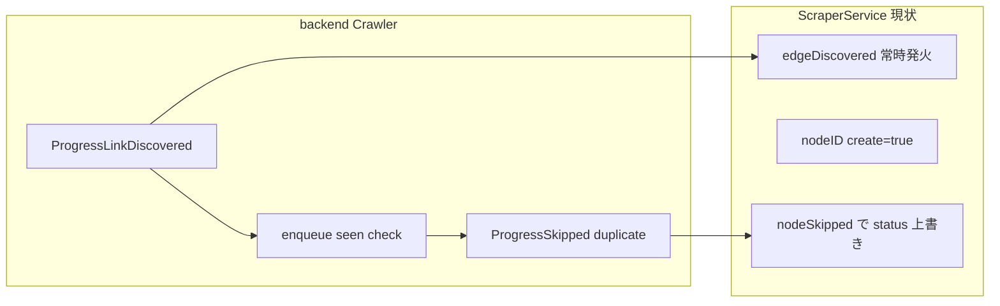
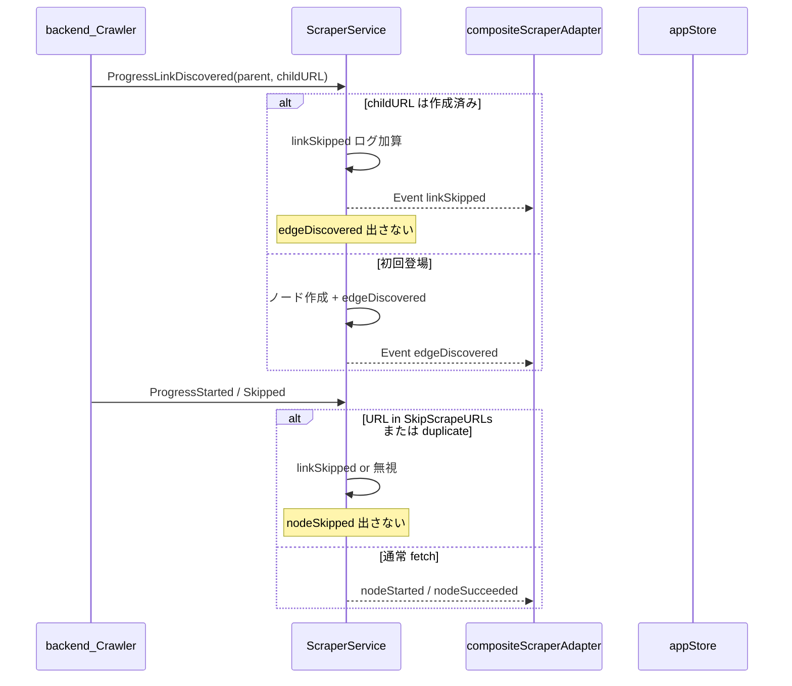

# 重複 URL 抑制 — Grill 合意 + 実装計画

## Grill で確定した決定

| 論点 | 決定 |
|------|------|
| 重複判定キー | 正規化 URL（[`domain.NormalizeCrawlURL`](front/internal/domain/urlnormalize.go) / backend `normalizeURL` と同一） |
| 「作成済み」スコープ | **ワークスペース既存ノード + 今回 crawl 内で既登場** の両方 |
| 重複時のノード | 新規作成しない |
| 重複時のエッジ | **作成しない・`edgeDiscovered` も出さない**（完全無視） |
| 重複時の実行 | 再取得トグルに従う（下記） |
| 既存ノードの status | **維持**（`nodeSkipped` で上書きしない） |
| 重複の UI 表示 | **クロールログ + 完了サマリー集計**（グラフは変化なし） |
| 初回発見 | **リンク発見時**にノード+エッジ作成（現行フロー維持） |
| 再取得トグル | **v1 に UI 含める**、デフォルト **OFF** |
| トグル OFF の対象 | **`status=success`（結果あり）のノードのみ**再 fetch しない |
| トグル ON | success ノードも BFS 到達時に再 fetch（グラフ重複抑制は常に有効） |
| 起点ノード | **トグルに従う**（success なら起点もスキップ可） |
| mode3 + トグル OFF | **success のみスキップ**、idle/error は実行 |

## 現状ギャップ



- [`scraper_service.go`](front/internal/usecase/wails_service/scraper_service.go) の `ProgressLinkDiscovered`（L394-411）が、既存 URL でも `nodeIDForURLLocked(childKey, true)` + `edgeDiscovered` を発火
- `ProgressSkipped`（L459-470）が `resolveNodeID(..., true)` でノード作成 + `nodeSkipped` イベント → success ノードが `skipped` に化ける
- backend は実行内 `duplicate` スキップ済みだが、**ワークスペース既存 success URL の再 fetch 制御なし**
- クロールログ UI なし（[`runHistory`](front/frontend/src/stores/appStore.ts) のサマリーのみ）

## 目標データフロー



## 実装方針

### 1. backend — success URL の fetch スキップ

[`CrawlConfig`](backend/internal/domain/model/config.go) に `SkipScrapeURLs []string` を追加（`exclude_urls` とは別。ユーザー除外ではなくオーケストレーション用）。

[`Crawler.enqueue`](backend/internal/core/crawler.go) / `skipReason` で:
- `SkipScrapeURLs` に含まれる URL は enqueue しない
- `ProgressSkipped` の `SkipReason` を **`already_success`** とする（既存 `duplicate` / `exclude_urls` と区別）

[`pkg/runner`](backend/pkg/runner) 経由でそのまま利用可能にする。

### 2. ScraperService — グラフ重複抑制の中核

[`crawlState`](front/internal/usecase/wails_service/scraper_service.go) を拡張:

- `linkSkippedCount` + 逐次ログ用スライス（またはカウンタのみでイベント都度 emit）
- `shouldMaterializeLink(parentURL, childURL) (emitEdge bool, reason string)`:
  - `urlToNode` に child があれば **duplicate_existing**
  - 今回 run で既に edge 素材化済みなら **duplicate_in_run**（`discoveredEdges` または `urlToNode` の今回追加分で判定）

**`ProgressLinkDiscovered` ハンドラ変更:**
- 作成済み → `emit(topicLinkSkipped, ...)` のみ。`edgeDiscovered` 禁止。`create=false`
- 初回 → 既存どおりノード作成 + `edgeDiscovered`

**`ProgressSkipped` ハンドラ変更:**
- `duplicate` / `already_success` → **`nodeSkipped` を出さない**（status 維持）
- 必要なら `linkSkipped` ログのみ（parentUrl 付き）
- `exclude_urls` / `max_pages` 等は従来どおり `nodeSkipped`

**`runMainBFS` 開始時:**
- `RescrapeExisting == false` → workspace の `status=success` ノード URL を `cfg.Crawl.SkipScrapeURLs` に設定
- seed / start も例外なし（合意どおり）

**`runMode3` / `runManualPass`:**
- トグル OFF 時、success ノードは scrape せず `linkSkipped` 的ログまたはサイレント skip（`nodeSkipped` は出さない）

### 3. API / Event 拡張

[`StartCrawlRequest`](front/internal/model/api.go):
```go
RescrapeExisting bool `json:"rescrapeExisting"`
```

新 Event トピック `scraper:crawl:linkSkipped`:
- payload: `parentUrl`, `targetUrl`, `reason` (`duplicate_existing` | `duplicate_in_run`)

[`CrawlSummaryDTO`](front/internal/model/api.go) に集計追加:
```go
SkippedDuplicateLinks int `json:"skippedDuplicateLinks"`
```

[`docs/api/scraper-ui.md`](docs/api/scraper-ui.md) を更新。

### 4. frontend — トグル・ログ・adapter

**状態（[`appStore`](front/frontend/src/stores/appStore.ts)）:**
- `rescrapeExisting: boolean`（default `false`）
- `crawlLogs: CrawlLogEntry[]`（run 開始でクリア、完了後も runHistory と併存可）

**UI:**
- [`ControlBar.tsx`](front/frontend/src/components/layout/ControlBar.tsx): Play ボタン近くに Checkbox「既存ノードを再取得」（`rescrapeExisting`）
- [`RightSidebar.tsx`](front/frontend/src/components/layout/RightSidebar.tsx): 実行中/直後の **クロールログ** セクション（`linkSkipped` 逐次行 + 完了サマリーに `skippedDuplicateLinks`）

**adapter（[`compositeScraperAdapter.ts`](front/frontend/src/adapters/compositeScraperAdapter.ts)）:**
- `StartCrawlRequest.rescrapeExisting` を渡す
- `TOPIC_LINK_SKIPPED` 購読 → `onLinkSkipped` コールバック（永続化不要、ログのみ）
- `onNodeSkipped` は従来どおりだが、重複系イベントは来なくなる

**型（[`types/crawl.ts`](front/frontend/src/types/crawl.ts), [`types/adapter.ts`](front/frontend/src/types/adapter.ts)）:**
- `CrawlLogEntry`, `onLinkSkipped`, `CrawlRunSummary.skippedDuplicateLinks`

bindings 再生成（`task generate-bindings` 等）。

### 5. テスト

| 対象 | 内容 |
|------|------|
| `scraper_service`（新規 or 抽出テスト） | 同一親・別親・既存 WS ノードで edgeDiscovered が 0 回になること |
| `scraper_service` | `duplicate` / `already_success` で `nodeSkipped` が出ないこと |
| `backend crawler` | `SkipScrapeURLs` で enqueue され `already_success` になること |
| `appStore` / adapter（任意・軽量） | `linkSkipped` が `crawlLogs` に蓄積、サマリー集計が一致 |

## 変更ファイル（主要）

- [`backend/internal/domain/model/config.go`](backend/internal/domain/model/config.go)
- [`backend/internal/core/crawler.go`](backend/internal/core/crawler.go)
- [`front/internal/usecase/wails_service/scraper_service.go`](front/internal/usecase/wails_service/scraper_service.go)
- [`front/internal/model/api.go`](front/internal/model/api.go)
- [`front/frontend/src/adapters/compositeScraperAdapter.ts`](front/frontend/src/adapters/compositeScraperAdapter.ts)
- [`front/frontend/src/stores/appStore.ts`](front/frontend/src/stores/appStore.ts)
- [`front/frontend/src/components/layout/ControlBar.tsx`](front/frontend/src/components/layout/ControlBar.tsx)
- [`front/frontend/src/components/layout/RightSidebar.tsx`](front/frontend/src/components/layout/RightSidebar.tsx)
- [`docs/api/scraper-ui.md`](docs/api/scraper-ui.md)

## 意図的にスコープ外

- 同一 URL の **別ノード ID**（DB `UNIQUE(workspace_id, url_normalized)` により発生不可）
- backend 側での `ProgressLinkDiscovered` 抑制（front で十分。backend は引き続き全リンク emit）
- `PauseController` / v2 最適化
