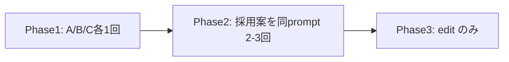

# Meguri アイコン — 生成・選定・セット手順

デスクトップアプリ **Meguri** 用アイコンの生成から `front/build/` への適用まで。

**必須参照**: [`.agents/skills/gpt-image-2/SKILL.md`](../.agents/skills/gpt-image-2/SKILL.md)（プロンプト作法・edit 制約・RunComfy 手順）

Windows では RunComfy CLI が使えないため [`tools/runcomfy/README.md`](../tools/runcomfy/README.md) の Docker ラッパーを使う。

---

## ワークフロー（統一性のため 3 Phase）

text-to-image を何度も別プロンプトで回すとパレット・線幅がブレる。**最終アセットは 1 枚にロックし、Phase 3 以降は edit のみ**。



| Phase | 目的 | 手段 |
|-------|------|------|
| 1 | モチーフ選定（環 / グラフ / 道筋） | text-to-image、各 **1 回のみ** |
| 2 | ベスト 1 枚をマスターに | 採用プロンプトで **同 JSON を 2〜3 回** |
| 3 | 32px 可読性・コントラスト | **edit のみ**、1 回 1 変更 |

**ルール**

- Phase 3 以降は text-to-image を再実行しない
- edit では `Keep composition and palette unchanged` を毎回先頭に置く
- `size=auto` on edit（SKILL 推奨）
- 別モチーフの要素を混ぜない

### 共有スタイルブロック

モチーフ部分だけ差し替え、先頭は固定:

```
Desktop app icon, centered, rounded-square canvas, dark blue-gray background #1b2636, minimal flat vector, subtle soft shadow, generous padding, high contrast silhouette readable at 32px, no text, no letters, no emoji.
```

---

## 前提セットアップ

```powershell
cd tools/runcomfy
copy .env.example .env
# .env に RUNCOMFY_TOKEN を設定
docker compose build
```

生成物は `tools/runcomfy/output/`（コンテナ内 `--output-dir /output`）に保存される。

---

## Phase 1 — 概念比較（各 1 回）

### A. 環＋巡回（推奨）

```powershell
docker compose run --rm runcomfy run openai/gpt-image-2/text-to-image `
  --input '{"prompt":"Desktop app icon, centered on a rounded-square canvas. Dark blue-gray background #1b2636. Single smooth circular arc almost completing a ring, small arrow on the arc suggesting continuous traversal, one teal accent dot #2dd4bf on the arc, off-white symbol #e8eaed. Minimal flat vector, subtle soft shadow, generous padding, high contrast silhouette readable at 32px. No text, no letters, no emoji.","size":"1024_1024"}' `
  --output-dir /output
```

→ `meguri-concept-A.png` にリネーム

### B. グラフノード

```powershell
docker compose run --rm runcomfy run openai/gpt-image-2/text-to-image `
  --input '{"prompt":"Desktop app icon, centered, rounded-square canvas, dark blue-gray background #1b2636. Three small teal circles #2dd4bf connected by thin off-white lines #e8eaed forming a loose triangle path, crawl-graph metaphor. Minimal flat vector, slight depth, generous padding, readable at 32px. No typography, no text.","size":"1024_1024"}' `
  --output-dir /output
```

→ `meguri-concept-B.png`

### C. 道筋・リンク辿り

```powershell
docker compose run --rm runcomfy run openai/gpt-image-2/text-to-image `
  --input '{"prompt":"Desktop app icon, centered, rounded-square canvas, dark blue-gray background #1b2636. One luminous off-white dot #e8eaed traveling along a gentle S-curve path, teal path accent #2dd4bf, metaphor for following links. Clean geometric flat style, high contrast silhouette, generous padding, readable at 32px. No text.","size":"1024_1024"}' `
  --output-dir /output
```

→ `meguri-concept-C.png`

### 比較のしかた

1. エクスプローラーで 3 枚を並べて表示
2. 32px / 64px に縮小したプレビューでシルエットが読めるか確認（タスクバー想定）
3. **1 モチーフだけ**選ぶ（混在させない）

---

## Phase 2 — マスター確定

採用した Phase 1 のプロンプト JSON を**そのまま** 2〜3 回実行する。

```powershell
# 例: モチーフ A 採用時 — 同一コマンドを繰り返す
docker compose run --rm runcomfy run openai/gpt-image-2/text-to-image `
  --input '{"prompt":"Desktop app icon, centered on a rounded-square canvas. Dark blue-gray background #1b2636. Single smooth circular arc almost completing a ring, small arrow on the arc suggesting continuous traversal, one teal accent dot #2dd4bf on the arc, off-white symbol #e8eaed. Minimal flat vector, subtle soft shadow, generous padding, high contrast silhouette readable at 32px. No text, no letters, no emoji.","size":"1024_1024"}' `
  --output-dir /output
```

出力を `meguri-master-v1.png` / `v2` / `v3` にリネームし、ベスト 1 枚を **マスター** とする。

### 今回の生成結果（参考）

| ファイル | 内容 |
|----------|------|
| `tools/runcomfy/output/meguri-concept-A.png` | Phase 1 モチーフ A |
| `tools/runcomfy/output/meguri-concept-B.png` | Phase 1 モチーフ B |
| `tools/runcomfy/output/meguri-concept-C.png` | Phase 1 モチーフ C |
| `tools/runcomfy/output/meguri-master-v1.png` | Phase 2 マスター候補 1 |
| `tools/runcomfy/output/meguri-master-v2.png` | Phase 2 マスター候補 2 |
| `tools/runcomfy/output/meguri-master-v3.png` | Phase 2 マスター候補 3 |
| `tools/runcomfy/output/meguri-refined-v1.png` | Phase 3 refine 例（v2 ベース） |

---

## Phase 3 — 仕上げ（edit のみ）

edit は **公開 HTTPS URL** が必要。RunComfy の出力 URL（`*.runcomfy.net`）をそのまま使える。

```powershell
docker compose run --rm runcomfy run openai/gpt-image-2/edit `
  --input '{"prompt":"Keep composition and palette unchanged; sharpen edges for small-size clarity, increase contrast between symbol and background, ensure symbol reads clearly at 32x32 pixels.","images":["<HTTPS_URL_OF_MASTER>"],"size":"auto"}' `
  --output-dir /output
```

1 回で 1 属性だけ変える（コントラスト OR エッジ OR パディング等）。満足するまで繰り返す。

最終 PNG を `meguri-final.png` などにリネームして保管。

---

## アプリへの適用

### 1. マスター PNG を配置

```powershell
copy tools\runcomfy\output\meguri-final.png front\build\appicon.png
```

（ファイル名は選んだ最終版に合わせる）

### 2. プラットフォーム形式を生成

`front/build/` で:

```bash
wails3 generate icons -input appicon.png \
  -macfilename darwin/icons.icns \
  -windowsfilename windows/icon.ico \
  -iconcomposerinput appicon.icon \
  -macassetdir darwin
```

または:

```bash
wails3 task common:generate:icons
```

（[`front/build/Taskfile.yml`](../front/build/Taskfile.yml) の `generate:icons` と同等）

**注意**: Windows 上では `.icns` / `Assets.car` の生成はスキップされる。macOS ビルド時に再生成する。

### 3. 差し替え対象

| パス | 用途 |
|------|------|
| `front/build/appicon.png` | マスター |
| `front/build/windows/icon.ico` | Windows EXE / NSIS |
| `front/build/darwin/icons.icns` | macOS `.app` |
| `front/build/ios/icon.png` | iOS |
| `front/build/appicon.icon/` | macOS Icon Composer（必要なら手動更新） |

### 4. dev UI favicon

```powershell
copy front\build\appicon.png front\frontend\public\wails.png
```

[`front/frontend/index.html`](../front/frontend/index.html) の favicon を確認:

```html
<link rel="icon" type="image/png" href="/wails.png" />
```

### 5. 検証

- `wails3 task build` または各 OS 向けタスクでビルド
- タスクバー / Dock / exe プロパティでアイコンを確認
- dev モードでブラウザタブの favicon を確認

### 6. `wails3 task common:update:build-assets` との順序

`front/build/config.yml` を更新して `update:build-assets` を流すと、手編集した build 資産が上書きされる場合がある。**アイコン適用は `update:build-assets` の後**に行う。

---

## トラブルシュート

| 症状 | 対処 |
|------|------|
| exit 77 | `RUNCOMFY_TOKEN` 未設定・無効 — `.env` を確認 |
| exit 65 | JSON / `size` 不正 — `1024_1024` のみ（text-to-image） |
| スタイルが毎回違う | Phase 2 以降 text-to-image をやめ edit のみにする |
| edit が失敗 | `images` URL が HTTPS で公開されているか確認 |

公式: [RunComfy CLI troubleshooting](https://docs.runcomfy.com/cli/troubleshooting)
