# Meguri — Windows リリース方針（提案）

Grill で確定した前提に基づく、Wails v3 デスクトップアプリの Windows 配布・自動更新の設計案。

## 決定事項サマリ

| 項目 | 決定 |
|------|------|
| 配布形式（初回） | NSIS インストーラー |
| コード署名（Authenticode） | **当面なし**（SmartScreen「発行元不明」は許容） |
| 更新メカニズム | **初回 NSIS / 以降 Wails 組み込み updater**（exe 差し替え） |
| 更新配信 | GitHub Releases |
| インストールスコープ | `user`（`%LOCALAPPDATA%` 配下、管理者権限不要） |
| 更新チェック | 起動時サイレント + メニュー「更新を確認…」 |
| 更新パッケージ検証 | SHA256SUMS + **Ed25519**（公開鍵をアプリに埋め込み） |
| バージョン | **git tag** → CI が `-ldflags` で注入、`config.yml` と同期 |
| CI/CD | tag push → GitHub Actions でビルド・署名・Release 自動公開 |
| 初回リリース | **Meguri リブランド完了後** に v1.0.0 |

---

## 背景と目的

### なぜ NSIS か

- exe 直配布より **正規のインストール導線**（ショートカット、アンインストール、WebView2 ブートストラッパ）を整えられる。
- 本プロジェクトは Wails v3 のビルド資産に NSIS が既に含まれる（`front/build/windows/Taskfile.yml`、デフォルト `FORMAT=nsis`）。

### NSIS だけでは消えない警告

未署名のままでは **SmartScreen の「発行元不明」** は NSIS インストーラーでも残る。これは Grill で **当面許容** とした。

| 警告の種類 | NSIS（未署名） | Authenticode 署名後 |
|------------|----------------|---------------------|
| SmartScreen「発行元不明」 | 出る | 評価蓄積で軽減 |
| exe 直配布時のインストール未整備 | NSIS で改善 | — |
| ウイルス対策の誤検知 | 署名で改善しやすい | 改善しやすい |

署名は将来フェーズとして `build/windows/Taskfile.yml` の `sign` / `sign:installer` を有効化する。

---

## アーキテクチャ概要

```mermaid
flowchart TB
  subgraph first["初回インストール"]
    DL["ユーザーが NSIS を DL"]
    NSIS["meguri-installer.exe"]
  INSTALL["user スコープにインストール\nWebView2 / ショートカット / レジストリ"]
    DL --> NSIS --> INSTALL
  end

  subgraph update["2回目以降の更新"]
    START["アプリ起動"]
    CHECK["Wails updater\nGitHub Releases API"]
    DL2["zip 取得 + SHA256 + Ed25519 検証"]
    SWAP["exe 差し替え + 再起動"]
    START --> CHECK
    CHECK -->|更新あり| DL2 --> SWAP
    CHECK -->|最新| START
  end

  subgraph release["CI（tag v*）"]
    BUILD["wails3 task build + package"]
    ZIP["meguri-windows-amd64.zip"]
    SUMS["SHA256SUMS + 署名"]
    GH["GitHub Release"]
    BUILD --> NSIS_OUT["meguri-installer.exe"]
    BUILD --> ZIP
    ZIP --> SUMS --> GH
    NSIS_OUT --> GH
  end
```



**ハイブリッドの理由**

- [Wails v3 Self-Update チュートリアル](https://v3.wails.io/tutorials/04-self-update-a-wails-app/) の組み込み updater は **zip 内の exe を差し替えて再起動**する。NSIS 再実行は不要。
- 初回だけ NSIS にすることで、アンインストーラー・WebView2・スタートメニュー登録を一度だけ整える。

---

## 配布物（GitHub Release 1 バージョンあたり）

| 資産 | 用途 | 取得者 |
|------|------|--------|
| `meguri-installer.exe` | NSIS インストーラー | **新規ユーザー**（README / ダウンロードページ） |
| `meguri-windows-amd64.zip` | `meguri.exe` を含む zip | **Wails updater**（インストール済みユーザー） |
| `SHA256SUMS` | 各資産の SHA-256 ダイジェスト | updater（整合性検証） |
| `SHA256SUMS.sig`（または同等） | Ed25519 署名（base64） | updater（真正性検証） |

ARM64 対応時は `meguri-windows-arm64.zip` を追加。現時点は amd64 のみでも可。

### Release ノート

- GitHub Release の Markdown が Wails デフォルト更新ウィンドウに表示される。
- セキュリティ修正は **必ず新しいバージョン番号**で出す（「このバージョンをスキップ」機能があるため）。

---

## ビルド設定

### 現状（要更新）

- `front/build/config.yml` — プレースホルダ（`My Company` / `My Product`）
- `front/build/windows/info.json` — 同上
- `front/main.go` — `Name: "meguri"`

Meguri リブランド完了時に以下を揃える:

```yaml
# front/build/config.yml（例）
info:
  companyName: "<Your Name or Org>"
  productName: "Meguri"
  productIdentifier: "com.meguri.app"
  description: "Web を巡り、取り込み、つなげるデスクトップワークスペース"
  version: "1.0.0"   # CI が tag から上書き同期
```

### NSIS パッケージ

```powershell
cd front
# user スコープ（推奨・Grill 確定）
wails3 task windows:package INSTALL_SCOPE=user
# 出力: build/windows/nsis/meguri-installer.exe（APP_NAME 依存）
```

`project.nsi` は `WAILS_INSTALL_SCOPE=user` で per-user インストール。管理者権限不要。

### updater 用 zip の作成

CI で NSIS と別に、Release 用 zip を生成する:

```powershell
# 例: bin/meguri.exe を zip 化
Compress-Archive -Path bin/meguri.exe -DestinationPath bin/meguri-windows-amd64.zip
```

アセット名は Wails GitHub provider の命名規則に合わせる（[updater-demo](https://github.com/wailsapp/updater-demo) 参照）。

---

## アプリ内 updater 実装

### 依存パッケージ

```go
import (
    "github.com/wailsapp/wails/v3/pkg/updater"
    "github.com/wailsapp/wails/v3/pkg/updater/providers/github"
)
```

### main.go への組み込み（概要）

`application.New` の後、`Run` の前:

```go
var currentVersion = "dev" // CI: -ldflags "-X main.currentVersion=1.0.0"

//go:embed updater-key.pub
var updaterPublicKey []byte

gh, err := github.New(github.Config{
    Repository:    "owner/meguri",
    ChecksumAsset: "SHA256SUMS",
})
if err != nil {
    log.Fatalf("github.New: %v", err)
}

if err := app.Updater.Init(updater.Config{
    CurrentVersion: currentVersion,
    PublicKey:      updaterPublicKey,
    Providers:      []updater.Provider{gh},
    CheckInterval:  6 * time.Hour,
    Window:         updater.WindowNone, // 定期チェックはサイレント
}); err != nil {
    log.Fatalf("Updater.Init: %v", err)
}
```

### 起動時チェック + メニュー

```go
// 起動直後（バックグラウンド）
go func() {
    if err := app.Updater.Check(context.Background()); err != nil {
        app.Logger.Error("update check", "error", err)
        return
    }
    // EventUpdateAvailable で UI 表示、または CheckAndInstall で標準ウィンドウ
}()

// メニュー
appMenu.Add("更新を確認…").OnClick(func(*application.Context) {
    go func() {
        _ = app.Updater.CheckAndInstall(context.Background())
    }()
})
```

`CheckInterval` と起動時 `Check` を併用する場合、重複チェックの間隔設計に注意（初回起動時のみ明示的 `Check` でも可）。

### バージョン注入（CI）

```text
-ldflags "-X main.currentVersion=1.0.0"
```

`wails3 task windows:build` の `BUILD_FLAGS` / Taskfile に組み込む。tag `v1.0.0` から `1.0.0` を抽出して渡す。

---

## Ed25519 署名パイプライン

### 鍵の生成（一度だけ）

```bash
ssh-keygen -t ed25519 -f updater-key -N "" -C "meguri-updater"
# updater-key     → GitHub Actions Secret（PRIVATE）
# updater-key.pub → リポジトリにコミット、go:embed でアプリに埋め込み
```

### リリース時

1. 各 Release 資産の SHA-256 を計算
2. `SHA256SUMS` を生成
3. 秘密鍵でダイジェストまたは SUMS ファイルに署名
4. 資産・SUMS・署名を **同一 Release に同時アップロード**（ドリフト防止）

Wails デフォルト GitHub provider が署名ファイルをどう取得するかは [Updater ガイド](https://v3.wails.io/) / `v3/examples/updater` で最新 API を確認すること。必要ならカスタム provider で `Signature` フィールドを返す。

---

## CI/CD（GitHub Actions 案）

### トリガー

```yaml
on:
  push:
    tags:
      - 'v*'
```

### ジョブ概要（`windows-latest`）

1. Checkout
2. Go / Node セットアップ
3. NSIS（`makensis`）インストール
4. `front/` で frontend ビルド
5. バージョン抽出: `v1.2.3` → `1.2.3`
6. `wails3 task windows:build`（`-ldflags` 付き）
7. `wails3 task windows:package INSTALL_SCOPE=user`
8. updater 用 zip 作成
9. `SHA256SUMS` + Ed25519 署名
10. `gh release create` または `softprops/action-gh-release` で公開

### Secrets

| Secret | 用途 |
|--------|------|
| `UPDATER_PRIVATE_KEY` | Ed25519 署名 |
| `GITHUB_TOKEN` | Release 公開（デフォルトで可） |

private repo の場合は `github.Config.Token` に PAT（`public_repo` または repo スコープ）が必要。

---

## ユーザー体験フロー

### 新規ユーザー

1. GitHub Release または Web から `meguri-installer.exe` を取得
2. SmartScreen 警告が出たら「詳細情報」→「実行」（未署名のため）
3. NSIS ウィザードでインストール（WebView2 未導入なら同梱ブートストラッパが動作）
4. スタートメニュー / デスクトップショートカットから起動

### 既存ユーザー（更新）

1. 起動時にバックグラウンドで GitHub Releases を確認
2. 更新あり → 通知または標準更新ウィンドウ（リリースノート付き）
3. ダウンロード → SHA256 + Ed25519 検証
4. 「再起動して適用」→ exe 差し替え → 自動再起動
5. 手動確認はメニュー「更新を確認…」

### アンインストール

NSIS がレジストリに uninstall エントリを登録。「アプリの追加と削除」から削除可能。

---

## 実装タスク（推奨順）

### Phase 0 — リブランド（前提）

- [ ] `config.yml` / `info.json` / `APP_NAME` を Meguri に統一
- [ ] GitHub repo を `meguri` に（または Releases 用 `owner/meguri` を確定）

### Phase 1 — ビルド・配布

- [ ] `INSTALL_SCOPE=user` で NSIS ビルドを検証
- [ ] WebView2 ブートストラッパ同梱の動作確認（クリーン Windows VM 推奨）
- [ ] Release 資産レイアウト（installer + zip + SHA256SUMS）を手動 1 回試す

### Phase 2 — updater

- [ ] Ed25519 鍵生成・`updater-key.pub` コミット
- [ ] `main.go` に `updater` 初期化
- [ ] 起動時サイレントチェック + メニュー項目
- [ ] `v0.9.0` → `v1.0.0` のテスト Release で E2E 確認

### Phase 3 — CI

- [ ] `.github/workflows/release-windows.yml` 作成
- [ ] tag push で全資産が自動公開されることを確認

### Phase 4 — 将来

- [ ] Authenticode 証明書取得
- [ ] `sign` / `sign:installer` タスクを CI に追加
- [ ] ARM64 ビルド・配布

---

## リスクと対策

| リスク | 対策 |
|--------|------|
| SmartScreen でユーザーがインストールを諦める | README に手順記載。中長期で Authenticode |
| 更新 zip が AV にブロック | 署名・評判の蓄積。ダイジェスト検証で改ざんは検知 |
| `SHA256SUMS` とバイナリの不整合 | CI で原子的一括アップロード |
| user スコープで企業ポリシーに弾かれる | 将来 machine スコープ + 署名を検討 |
| スキップされたバージョンにセキュリティ修正 | 必ず新バージョン番号でリリース |

---

## 参考リンク

- [Wails v3 — Self-Updating Wails App](https://v3.wails.io/tutorials/04-self-update-a-wails-app/)
- [Wails updater demo リポジトリ](https://github.com/wailsapp/updater-demo)
- 本リポジトリ: `front/build/windows/Taskfile.yml`（NSIS / sign タスク）
- 本リポジトリ: `docs/meguri-rebrand.md`（製品名・識別子）

---

## Grill ログ（決定経緯）

1. **警告対策** → SmartScreen は署名まで許容。NSIS はインストール導線整備が主目的（B）
2. **更新配信** → GitHub Releases（A）
3. **更新適用** → チュートリアル確認後、初回 NSIS + 更新は Wails updater（C）
4. **インストールスコープ** → user（A）
5. **チェックタイミング** → 起動時サイレント + メニュー（D）
6. **更新署名** → SHA256 + Ed25519（B）
7. **バージョン** → git tag → ldflags（A）
8. **CI** → tag 全自動（A）
9. **リブランド** → Meguri 完了後に v1.0.0（A）
